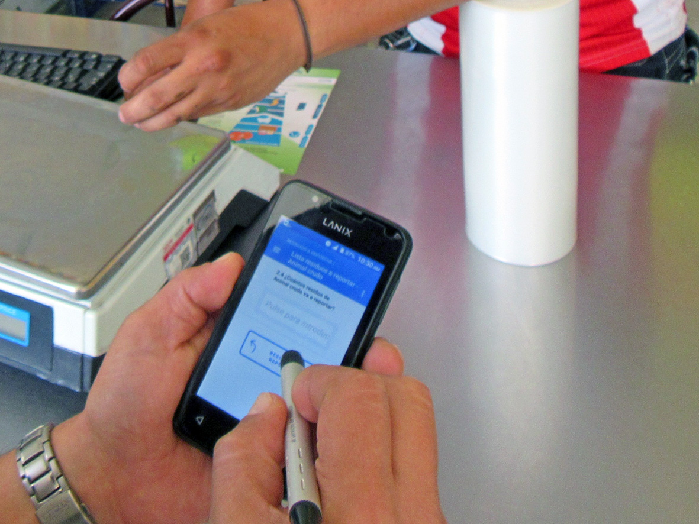
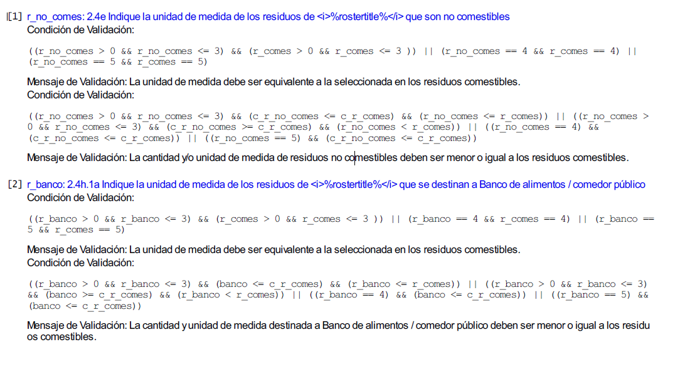

---
title: "**Prueba piloto 01, Aguascalientes**"
--- 

<br>
<br>

<div class=text-justify>

```{r organicos_aa, fig.align='center', echo=FALSE, out.width = "100%", cache=TRUE}


```

<br>
<br>

# **Objetivos de la prueba**
 
<br>
 
**Objetivo 1**. Probar el contenido temático y la redacción de las preguntas del instrumento de captación para asegurar que el informante proporcione datos de calidad.  
 
**Objetivo 2**. Probar la estrategia operativa que incluye desde los trámites administrativos, la determinación de la muestra, el levantamiento, captación y procesamiento de la información para asegurar que los procesos de obtención de la información sean los adecuados.

**Objetivo 3**. Probar las herramientas tecnológicas que incluyen la ejecución de aplicación de los entrevistadores, el funcionamiento de los dispositivos móviles y sus características, la comunicación con la nube para envío y recepción de entrevistas, así como la carga y descarga de las bases de datos para el aseguramiento de la información obtenida en campo.

**Objetivo 4**. Probar los mecanismos de supervisión física y virtual para asegurar la obtención, resguardo y procesamiento de los datos obtenidos de las entrevistas. 

<br>
<br>

# **Antecedentes**

<br>

**ODS**. El tema de la pérdida y desperdicio de alimentos ha escalado a nivel de los Objetivos de Desarrollo Sostenible (ODS) especialmente en la meta 12.3, en la que se propone que los países se comprometan a reducir a la mitad, el consumo mundial de alimentos per cápita a nivel minorista y de consumo, así como reducir las pérdidas de alimentos a lo largo de las cadenas productivas y de suministro (incluidas las perdidas postcosecha) para 2030.

**UNECE**. Recientemente la Comisión Económica de las Naciones Unidas para Europa (UNECE por sus siglas en inglés) ha señalado como prioridades para los ODS "Promover la producción y el consumo sostenibles de alimentos. La UNECE trabaja con los países para aumentar la sostenibilidad de la producción y el consumo de alimentos y la prevención de la pérdida de alimentos, incluso mediante el desarrollo de normas y recomendaciones agrícolas internacionales. Sus Convenios internacionales sobre el cruce de fronteras y el transporte de alimentos perecederos ayudan a los países a reducir el desperdicio y la pérdida de alimentos durante el transporte." UNECE (2019)

**BM**. Para el Banco Mundial la pérdida y desperdicio de alimentos no se puede desvincular del tema de los recursos naturales y la biodiversidad, pues "Según un reciente informe de las Naciones Unidas (ONU), numerosas especies que están indirectamente involucradas en la producción de alimentos, tales como las aves que se comen las plagas agrícolas y los manglares que ayudan a purificar el agua, son menos abundantes que en el pasado. Se estima que más del 33 % de las poblaciones de peces están sobreexplotadas. La pérdida de las colonias de abejas va en aumento y el 17 % de los polinizadores vertebrados, como los murciélagos y las aves, están en peligro de extinción. Más aún, las especies que son cruciales para nuestros sistemas alimentarios, una vez que se pierden, no se pueden recuperar."

"Sin lugar a dudas, las bases de nuestros sistemas alimentarios están siendo afectadas y esto es insostenible. La situación empeorará a medida que aumente la producción de alimentos para alimentar a una creciente población de cerca de 10 000 millones de personas en 2050." BM, 2019.

**WRI, 2018**. El crecimiento de la población mundial, de 7 mil a casi 10 mil millones de personas en el mundo más el incremento de ingresos de los países en desarrollo, hará crecer la demanda de alimentos al menos en un 50% más de lo que actualmente se consume a la vez que la alimentación de animales base de la alimentación, demandará un aumento de hasta 70% de la producción mundial. La producción de alimentos para América Latina tendría que duplicarse; en términos generales se requerirá mayor superficie de tierras cultivables a costa de la deforestación de bosques y selvas. El impacto del aumento de la superficie cultivable en la mitigación de los Gases Efecto Invernadero y la captura de Carbono será negativo, lo que redunda en aumento de la temperatura global.

**FAO**. Esta institución internacional es la fuente de la investigación documental y la metodología usada por muchas otras instituciones que trabajan para la medición de la pérdida y desperdicio; para no ser repetitivos, se mencionan aquí aspectos no abordados con anterioridad, entre ellos, la cantidad de agua que se requerirá para la producción de alimentos, estimada en un 19% más del agua destinada para el riego. Lo que suma a los temas expuestos de agotamiento de recursos naturales para enfrentar la demanda de la población mundial de alimentación.

<br>
<br>

# **1 Síntesis de la prueba**

<br>

## **1.1 Cobertura Geográfica y Sectorial de la Prueba**

Se realizó en el estado de Aguascalientes considerando que las unidades de observación no hubieran sido elegidas para otras encuestas, esta actividad se hizo con el apoyo de la coordinación estatal de esta entidad con quienes se consensaron las unidades de muestreo.

<br>

## **1.2 Periodo de realización** 

Se realizó del 30 de septiembre al 11 de octubre de 2019

<br>

## **1.3 Estrategia operativa** 

Entrevista directa en las unidades de la muestra

<br>

## **1.4 Actividades realizadas**  

<br>

**Actividades Administrativas**
<br>

1.	Tramite de viáticos (gastos de campo).

2.	Tramite de vehículos.

3.	Generación de oficios de presentación.

4.	Gestión de uniformes.

5.	Gestión de dispositivos Android con GPS.

<br>

**Actividades técnicas u operativas** 
<br>

1.	Definición de la estrategia operativa.

2.	Determinación de la muestra.

3.	Capacitación del personal operativo.

4.	Elección del Personal Operativo.

5.	Dispositivos: Operaron 9 dispositivos móviles con la aplicación de entrevistador.

6.	Definición de rutas por equipos de entrevistadores.

7.	Entrevistas

    a.	Verificación de la unidad de muestra por nombre y actividad
    
    b.	Toma de coordenadas en el lugar de la entrevista (unidad de observación)
    
    c.	Toma del dato (cantidad de la PDA)
    
    d.	Toma de fotografía de los residuos
    
    e.	Supervisión en campo para cada pareja de entrevistadores
    
    f.	Guía de observación para cada entrevista
    
    g.	Aprobación/rechazo de cuestionarios por supervisores y sede  

<br>

## **1.5 Resultados de entrevistas**  

<br>

1. Se visitaron 138 unidades de observación.

2. Se obtuvieron 120 entrevistas completas.

3. El tiempo promedio de la entrevista 16 minutos.

4. Personal operativo: 10 entrevistadores; 3 supervisores; 1 apoyo técnico.

<br>

## **1.6	Captación de la información**

1. Funcionamiento correcto de los dispositivos.

2. Funcionamiento correcto de la aplicación Banco Mundial(BM o World Bank).

3. Carga correcta de las entrevistas a la base de datos.

4. Validación en plataforma BM de las entrevistas.

5. Descarga correcta de la base de datos

<br>

## **1.7.	Procesamiento de la información y calidad de los datos**

1.	Validación en la aplicación.

2.	Variables auxiliares (preguntas adicionales).

3.	Validación de los datos en gabinete.

4.	Frecuencias de los datos e indicadores de respuesta por pregunta.

5.	Liberación de la base de datos.

6.	Duración de entrevista.

<br>

## **1.8	Presentación de resultados**

1.	Indicadores básicos de tendencias.

2.	Gráficas.

<br>
<br>
<br>

# **2	Desarrollo del proyecto**

<br>

## **2.1 Tecnología y desarrollo informático** 

<br>

Se utilizaron dispositivos móviles del tipo Android, a los que se les instaló un software que permite el acceso y llenado de un cuestionario electrónico durante la entrevista con el informante, mismo que se guarda en el dispositivo hasta el momento que el entrevistador decida enviar el archivo a la plataforma o repositorio en la nube.

Para que lo anterior sucediera, el dispositivo podía enviarlo con datos o hasta que se encontrara en una red de wifi. En el caso de este operativo se decidió que se enviaran los cuestionarios al final de la jornada mediante el acceso a internet.

El resultado fue satisfactorio para una gama importante de dispositivos móviles, pues se utilizaron, desde versiones muy sencillas hasta modelos recientes; con sistemas operativos de Android 5.0 en adelante. Para versiones anteriores previamente se detectó la dificultad para operar, por lo que fueron descartadas en la prueba piloto.

En la mayoría de los casos, la toma de coordenadas y de fotografías fue posible. Asimismo, se comprobó diariamente que la conexión para recibir los cuestionarios en la nube fuera satisfactoria, sin que hubiera pérdida de información alguna.

<br>


```{r organicos, fig.align='center', echo=FALSE, out.width = "60%", cache=TRUE}



```

<br>
<br>

## **2.2 Estrategia operativa**

<br>

Se puso a prueba, la planeación sobre los equipos de trabajo, el número de entrevistadores y supervisores, los mecanismos de movilización de los recursos humanos, supervisión y asesoría en campo; los tiempos de entrevista; las cargas diarias de trabajo; los resultados de entrevista; las citas previas y reagenda de entrevistas; la identificación de las unidades de muestreo; el informante adecuado; el tipo de entrevista, entre otros aspectos con resultados satisfactorios.
De manera general la planeación de la estrategia operativa tuvo buenos resultados pues se llevó a cabo tal como fue concebida, los ajustes que se deben hacer tienen que ver con situaciones no previstas como ausencias o faltas de personal a la jornada de trabajo, por razones personales o de enfermedades. Los reportes de las bases de datos serán de utilidad para revisar y asignar cargas de trabajo y tramos de control más apegados a la realidad.  

<br/>

<p align="center"> **Estrategia general de la ERAMO** </p>

<br>

<iframe src="prueba_p1/archivo_pdf/Diagrama General MPEG.pdf" style="width:100%; height:500px;" frameborder="0"></iframe>
<br/>

<br>

Para dar certeza y confianza de la calidad de los datos obtenidos, fue necesario establecer desde la planeación, los mecanismos que hicieran posible esta condición. Entre las acciones llevadas a cabo antes del operativo de las entrevistas, se hicieron pruebas de la plataforma, el cuestionario electrónico y los dispositivos móviles. Entre otros aspectos que se pusieron a prueba destacan: 

<br>
<br>

## **2.3	Definición de la muestra** 

<br>

Se definió una muestra que incorporara las clases de actividad relacionadas con alimentos, tomando como base el Directorio Estadístico Nacional de unidades de observación (DENUE). Con base en ello, se hizo una muestra para el estado de Aguascalientes con 138 unidades de observación.

<br>

```{r tab106, echo=FALSE, fig.align='left', warning=FALSE}

library(DT)
tab106 <- read.csv("muestra_eramo_casera_ags/muestra_ags_01.csv", header=T)
names(tab106) <- c("id","nombre del establecimiento","razon social","codigo SCIAN","nombre de la actividad","personas ocupadas","tipo de vialidad","nombre de vialidad","tipo_v_e_1","nom_v_e_1","tipo_v_e_2","nom_v_e_2","tipo_v_e_3","nom_v_e_3","numero exterior","letra exterior","edificio","edificio_ext","numero_int","letra_int","tipo asentamiento","nombre asentamiento","tipo centro comercial","nombre centro comercial","num_local","cod_postal","cve_ent","entidad","cve_mun","municipio","cve_loc","localidad","ageb","manzana","telefono","correoelec","www","tipo unidad economica","latitud","longitud","fecha_alta","Observaciones","Sector SCIAN","Asignacion")
DT::datatable(tab106,filter = 'top', options = list(
  pageLength = 5, autoWidth = TRUE, scrollX = TRUE,
  fixedColumns = TRUE, language = list(
    info = "Mostrando registros del _START_ al _END_ de un total de _TOTAL_ registros",
    paginate = list(previous = 'Anterior', `next` = 'Siguiente'),
    search =  "Buscar:", lengthMenu = "Mostrar _MENU_ registros" )
  ))

```

<br>
<br>

## **2.4 Cargas de trabajo**
<br>

Se asignó una carga de trabajo de 35 entrevistas en promedio por equipo de entrevistadores. A dos equipos se les asignó entre su carga de trabajo, unidades rurales de producción y a los otros dos, solamente urbanas.

El objetivo fue probar los tiempos de traslado, duración de la entrevista, mecanismos de comunicación y coordinación entre equipos y con la organización central, con la premisa de la seguridad del personal en campo.

<br>

## **2.5 Definición de rutas** 
<br>

Para asegurar que los tiempos de traslado de los equipos de entrevistadores fueran óptimos, se establecieron rutas por la ubicación de los establecimientos, utilizando aplicaciones de Google maps.

<br/>
<p align="center"> **Estrategias de recorrido de los entrevistadores** </p>

<iframe src="prueba_p1/archivo_pdf/recorridos.pdf" style="width:100%; height:500px;" frameborder="0"></iframe>

<br/>
<br>

## **2.6	Capacitación del personal operativo** 
<br>

Para asegurar que el resultado de la entrevista fuera exitoso, y la información fuera la que se definió como clave para captar, se llevó a cabo un curso de capacitación que incluyó el manejo del dispositivo móvil, el llenado del cuestionario, así como las técnicas de la entrevista.

<br>

## **2.7	Verificación de insumos de trabajo** 
<br>

Se diseñó un formato para un pase de lista de los insumos y materiales que los entrevistadores debían portar consigo al momento de salir a campo para la obtención de las entrevistas. 

<br>

## **2.8 Concertación de entrevistas**
<br>

Semanas previas al operativo de campo, se hicieron llamadas a establecimientos medianos y grandes para asegurar una cita donde se concediera la entrevista por parte de alguna persona identificada por la encuesta como informante adecuado, esto es la persona que conoce y está autorizada para proporcionar la información.

<br>

## **2.9 Supervisión en campo y gabinete** 

<br>

Se establecieron cuatro equipos de trabajo con dos entrevistadores cada uno y un supervisor para ubicar a los equipos en campo, definiendo las rutas, el inicio, consecución y término; la aplicación de la entrevista en las unidades definidas; y el apoyo a problemas y situaciones no contempladas.

La plataforma informática del BM que se utilizó permitió dar seguimiento en tiempo real a las entrevistas obtenidas, las rutas tomadas y la ubicación de la unidad a la que se le aplicó el cuestionario. La plataforma cuenta con un mapa que se alimenta de las coordenadas obtenidas lo que permite ubicar no solamente el lugar de la toma de coordenadas, sino el día y hora de la obtención del punto, lo que permite calcular tiempos y distancias de los recorridos.

Cabe mencionar que este bien público tiene disponibles aplicaciones para los entrevistadores y para los supervisores, por lo que el proceso de obtención de la entrevista y validación de ésta por parte del supervisor pudo darse al mismo tiempo.

[**Plataforma de administración del World Bank(WB)**](https://eramop01.mysurvey.solutions/Account/LogOn?ReturnUrl=%2F){target="_blank"}

<br>

## **2.10	Herramientas tecnológicas para el operativo**
<br>

1.	Los dispositivos utilizados para la aplicación de la entrevista fueron móviles tipo smartphone: Lanix con Android 5.0; M4 con versión de Android 6.0; y Motorola con sistemas Android 7.0 y 8.0 y 9.0. La descarga y ejecución del cuestionario en estos dispositivos fue correcta, cada cuestionario tuvo un identificador único (ID) que permitiera relacionarlo con la unidad de observación entrevistada. 

2.	La aplicación del BM diseñada para ejecutar el cuestionario en dispositivos Android funcionaron correctamente en los dispositivos con versiones superiores a 5.0; no así en versiones inferiores.

3.	La plataforma informática que funciona como repositorio de los cuestionarios, pudo recibir los cuestionarios recabados en las entrevistas, sin problema, tanto los que se enviaron con red de wifi como los que enviaron con pago del propio dispositivo móvil.

4.	La validación de las entrevistas se hizo a través de la plataforma en la que se establecieron privilegios para los usuarios definidos como supervisores, a quienes se les facultó para revisar y aprobar o rechazar cuestionarios en función de los criterios de validación establecidos previamente, además de [**Supervisión en tiempo real**](https://eramop01.mysurvey.solutions/Account/LogOn?ReturnUrl=%2F){target="_blank"}


5.	Al mismo tiempo se llevaron a cabo pruebas de descarga de archivos en diferentes formatos, para asegurar el acceso a las bases de datos que crea la plataforma, su transformación para el análisis y procesos posteriores, lo que se hizo de manera satisfactoria.

<br>

##  **2.11	Cuestionario electrónico:**

<br>

### **2.11.1 Preguntas**
<br>

Se diseñó un cuestionario electrónico para ser utilizado en dispositivos móviles, mediante una entrevista directa, se aplicó el cuestionario en la muestra seleccionada, los cuestionarios aplicados se guardan en el dispositivo y al final de la jornada se enviaron usando una red de WiFi.  

La plataforma utilizada es un bien público que el Banco Mundial, pone a disposición de la población, mediante ésta, se diseña el cuestionario, se vincula con los dispositivos y sirve de repositorio para almacenar la información durante un tiempo determinado, pasado el cual, se elimina la información captada.

El cuestionario presenta la siguiente estructura:

<br>

<iframe src="procesamiento/cuestionario_prueba_piloto_01.pdf" style="width:100%; height:650px;" frameborder="0"></iframe>

<br>

La descripción de la base de datos correspondiente, o [**(FD)**](procesamiento/bd_liberada/fd_eramo_p01.xlsx), puede dar una mejor idea de la estructura final de las variables captadas.

<br>

### **2.11.2	Conceptos** 
<br>

Los conceptos contenidos en el instrumento de captación, fueron revisados exhaustivamente en función del glosario de términos y bibliografía referente a los avances en investigaciones sobre la Pérdida y Desperdicio de Alimentos (PDA) y en algunos casos, se adaptaron los términos a un lenguaje más acorde con la realidad de nuestro país.

<br>

### **2.11.3	Respuesta del informante**
<br>

Se diseño una guía de observación para captar las respuestas y reacciones del informante, con el propósito de obtener un registro que permitiera sistematizar la experiencia en campo al momento de la entrevista. El formato diseñado evita la interpretación subjetiva del observador para dar paso a una observación clara y objetiva de determinados aspectos de la entrevista y en particular de quien proporciona la información. 

<br>
<p align="center"> **Guía de Observación para el operativo de campo** </p>
<br>


<iframe src="prueba_p1/archivo_pdf/GUIA_OBSERVACION_PRUEBA01_ERAMO.pdf" style="width:100%; height:500px;" frameborder="0"></iframe>

<br>
<br>

**Frecuencias de respuesta en las preguntas de observación de la entrevista**
<br>

```{r tab0x11, echo=FALSE, message=FALSE}

library(kableExtra)
tabtab0x11 <- read.csv("prueba_p1/tablas/preg_observacion.csv", header=F)
names(tabtab0x11) <- c( "PREGUNTAS", "SI", "NO", "SIN RESPUESTA")
kableExtra::kable(tabtab0x11, align = c('l','l','l','l')) %>%
  kableExtra::kable_styling(bootstrap_options = c("striped", "hover"))

```

<br>
<br>

**Frecuencias de observación respecto a si el informante comprendió la pregunta o concepto**
<br>

```{r tab0x12, echo=FALSE, message=FALSE}
library(kableExtra)
tabtab0x12 <- read.csv("prueba_p1/tablas/preguntas.csv")
names(tabtab0x12) <- c( "PREGUNTAS", "SI", "NO", "SIN RESPUESTA")
kableExtra::kable(tabtab0x12, align = c('l','l','r','c')) %>%
  kableExtra::kable_styling(bootstrap_options = c("striped", "hover"))
``` 
<br>
<br>

### **2.11.4	Captura de fotografías** 
<br>

Debido a que la plataforma y herramientas informáticas definidas, permiten tomar fotografías como evidencia del trabajo, se puso a prueba la capacidad tanto de los dispositivos móviles para la captura, almacenamiento y transferencia de archivos, como del repositorio en la nube para su resguardo. El resultado fue positivo pues una gran cantidad de fotos ahora es parte de nuestro acervo fotográfico.

<br>

```{r fotoresi, fig.align='center', echo=FALSE, out.width = "60%", cache=TRUE}

knitr::include_graphics("prueba_p1/imagenes/fotoresiduos.png")

```
<br>


### **2.11.5 Reunión de evidencias**
<br>

Se consideró desde la planeación la posibilidad de encontrar en campo evidencias que indicaran la necesidad de hacer ajustes al cuestionario, sus preguntas o secuencia; al operativo definido en la planeación o la revisión de las unidades de observación definidas como objeto de estudio; resultado de la prueba piloto, muchas de estas situaciones están sujetas aún a revisión, con miras a la prueba planeada para el 2020. 

Los principales resultados de la observación conceptual de las entrevistas se muestran enseguida.

<br/>
<p align="center"> **Relatorías de la observación en campo** </p>

<br>

<iframe src="prueba_p1/archivo_pdf/Relatorias1.pdf" style="width:100%; height:500px;" frameborder="0"></iframe>

<br/>

Las principales observaciones de la prueba se pueden resumir en la dificultad de informante para entender los conceptos de pérdida y desperdicio de alimentos, el manejo de los instrumentos y el desarrollo informático. Esta fue una de las principales preocupaciones de la prueba, la respuesta del informante, no sólo en términos de los datos que proporcionara, sino de su actitud y compresión ante este tema relativamente nuevo para ellos y nosotros. Sin duda los resultados obtenidos servirán al propósito establecido al inicio de la prueba para mejorar todos los aspectos conceptuales, operativos y materiales desarrollados hasta el momento en beneficio de la obtención de una información de calidad.

<br>
<br>
<br>


# **3	Procesamiento**
<br>

## **3.1 Preparación de la Base de Datos** 

<br>

Este proceso comprende todos los pasos necesarios que deben seguirse para tratar los datos captados en campo (Base de datos de salida), a fin de depurar y eliminar cualquier inconsistencia en los mismos, de tal modo que pueda generarse una versión de la base de datos que pueda ser explotada con confianza.

<br>

## **3.2 Validación en línea del cuestionario**
<br>

Una de las grandes ventajas que proporcionó el uso de la plataforma del cuestionario electrónico, fue la posibilidad de insertar dentro del instrumento de captación, validaciones básicas que aseguran la calidad de los datos desde la salida misma de captura. Específicamente, comprenden al menos 3 tipos de validaciones:

1) De secuencia lógica del cuestionario. Corresponden a las validaciones referentes al flujo de las preguntas, y comprenden los filtros y pases entre preguntas y secciones. La aplicación garantiza que al programarse dichos elementos, no pueda cerrarse la entrevista si existen errores de este tipo, por lo que el entrevistador puede corregir de inmediato cualquier situación indeseable al respecto.

2) Rangos válidos. El cuestionario electrónico garantiza que una variable no podrá contener un rango distinto de valores para lo que se programa. Esto excluye también la posibilidad de captar caracteres o tipos de datos ajenos a lo que se espera.

3) Validaciones especiales. El diseñador del cuestionario puede incluir validaciones adicionales relacionadas con aspectos lógicos o conceptuales de interrelación entre dos o más preguntas del cuestionario. Específicamente, para esta encuesta se construyeron validaciones para hacer consistentes las unidades de medida de los residuos declarados entre sí, de modo que si alguien declara una cantidad de residuos total, al momento de desglosar de ellos la cantidad no comestible, esta última no resulte mayor que la primera. También se verifica que si alguien declaró por ejemplo unidades en litros en una pregunta, no pueda declarar toneladas en otra, por ejemplo. Las expresiones para las condiciones de validación fueron las siguientes:

<br>

```{r i_3_3_1, fig.align='center', out.width= '95%', echo=FALSE, cache=TRUE}



```


<br>
<br>

## **3.3 Bitácora de procesamiento**

El conjunto de procedimientos aplicados a la BD de salida para llegar hasta la construcción de la BD para explotación, puede encontrarse en el documento que se muestra a continuación, denominado *Bitácora de Procesamiento*.

<br>

<iframe src="procesamiento/bitacora.pdf" style="width:100%; height:650px;" frameborder="0"></iframe>

<br>
<br>


## **3.4 Base de datos liberada**
<br>

### **3.4.1 Contenido de la Base de Datos**

<br>

La base de datos liberada para explotación, presenta la siguiente estructura:

<br>

| **Tabla** |  **Contenido** | **Registros** | **Campos** |
|:----------------------|:----------------------|----------------------:|----------------------:|
| establecimientos2.csv | Datos generales de los establecimientos y tipo de residuos que generan | 120 | 34 |
| lista_residuos2.csv | Tipo y número de residuos declarados en los establecimientos | 152 | 10 |
| lista_tiporesiduos2.csv | Residuos de los establecimientos y su caracterización  | 191 | 26 |
| interview_diagnostics2.csv | Tiempos de entrevista  | 119 | 9 |
| muestra.csv | Listado de unidades de observación que conformaron la muestra original | 106 | 8 |

<br>

Se pone a disposición del lector la [base de datos](procesamiento/bd_liberada.zip){target="_blank"}, que incluye además un [archivo de descripción (FD)](procesamiento/bd_liberada/fd_eramo_p01.xlsx) dentro de la carpeta de descarga.

<br>

### **3.4.2 Diagrama Entidad-Relación**

<br>

El modelo de interrelaciones de la base de datos liberada para explotación queda de acuerdo a lo siguiente:

<br>

```{r i_3_3_3_2, fig.align='center', out.width= '100%', echo=FALSE, cache=TRUE}

knitr::include_graphics("procesamiento/diag_ent_rel.png")

```

<br>
<br>

### **3.4.3 Frecuencias por pregunta**

<br>

Las frecuencias obtenidas para cada variable de la base de datos final, puede descargarse y consultarse en el archivo [frecuencias.xlsx](procesamiento/frecuencias.xlsx){target="_blank"}

<br>
<br>

## **3.5 Procesos sobre la base de datos para explotación**

<br>

### **3.5.1 Cálculo de variables auxiliares**
<br>

A fin de explotar adecuadamente ciertas variables, es necesario con frecuencia, calcular variables auxiliares partir de las que aparecen en la base de datos. 

En el caso específico de nuestra BD, hubo que construir 3 variables auxiliares:

1. Tiempo de duración de la entrevista en minutos. Debido a que el formato de esta variable que arroja el sistema de captura es el estándar para variables de tiempo (dd.hh:mm:ss). 

2. Cantidad de residuos (sólidos) semanales en kg. Dado que la captación de residuos involucró varias unidades posibles (*gramos, kilogramos, toneladas, litros, otra unidad*), así como diversos tiempos o periodos de recolección de los mismos (*diario, semanal, quincenal, mensual, otro periodo*), se tuvo que calcular, siempre que fuera posible la cantidad de residuos semanales de cada residuo declarado. El algoritmo de cálculo es simple y consiste simplemente en homogenizar las unidades de masa y de tiempo a kg/semana. En este cálculo se excluye a los establecimientos que declaran sus residuos en litros, cuya frecuencia en la muestra fue muy baja, así como a quienes declaran otra unidad de medida y en su especificación, ésta resulta del tipo "botes", "cubetas", "bolsas", y otras similares, que representan un desafío adicional para la medición. Algo similar sucede en el caso de la declaración de la categoría *Otro* de la pregunta *2.4f Periodo en el que reúne esos residuos*, ya que las respuestas pueden variar desde "*cada tercer día*" hasta "*esporádico*" o "*eventualmente*". Se deben, por tanto, diseñar estrategias para el tratamiento de este tipo de información con miras al siguiente levantamiento.

3. Cantidad de residuos no comestibles (sólidos) semanales en kg. Es el mismo caso de la variable anterior, sólo que usando los residuos no comestibles. Dado que las unidades de medida y de temporalidad de residuos se captaron de la misma forma, la variable calculada se trata de la misma forma y presenta los mismos problemas que la anterior.

<br>

### **3.5.2 Codificación**

Se tiene previsto un proceso de codificación de las variables abiertas del cuestionario. De este modo, se pretenden construir categorías que puedan ser de utilidad para la siguiente prueba piloto. Esto requiere un fuerte trabajo de análisis conceptual, que de ser posible se refuerce a través de la consulta bibliográfica y se apoye en el marco teórico del proyecto. Sería deseable también que actores externos involucrados en la materia contribuyeran a mejorar el instrumento de captación en estos aspectos.

<br>
<br>
<br>

# **4 Resultados**
<br>

## **4.1 Consideración inicial acerca de las cifras que se obtienen de la muestra**

Antes de dar paso al análisis de los datos captados en el operativo de prueba, es necesario recordar al lector que se debe tener presente que la muestra no fue construida en forma probabilística, de tal forma que no pueden obtenerse inferencias y ni siquiera pueden usarse las cifras obtenidas como indicadores de estimaciones o aproximaciones a los datos poblacionales. Todas las cifras que a continuación se presentan, deben ser tomadas con precaución, pues están lejos de constituir indicadores. Se analizan únicamente con el fin de mostrar ciertas tendencias o anticipar cierto tipo de respuestas a las preguntas realizadas.

Por esta razón, tampoco se construyeron tabulados, y los indicadores obtenidos como las medias o medianas, sin duda están sesgadas. Por lo tanto, una lectura literal de las mismas podría resultar engañosa o perjudicial para el análisis que se desarrolla.

Una consideración adicional consiste en recordar que el tamaño de la muestra es muy pequeño como para intentar concluir acerca de los estadísticos que se mostrarán. Se debe entender que el objetivo primordial de esta prueba piloto he sido el de arrojar luz sobre la información que puede ser obtenida mediante una encuesta de este tipo, y de la cual no existen antecedentes en el país. 

<br>


## **4.2 Cifras Globales**
<br>

Se visitaron 138 establecimientos, de los cuales en 120 se pudo obtener entrevista (87%). En 10 casos no fue posible obtener entrevista porque los establecimientos estaban cerrados, cambiaron de domicilio o se encontró un establecimiento que no tiene que ver ya con los alimentos (7.2%), el número de negocios que se negaron a proporcionar información fue de 6 (4.3%) y en 2 casos (1.4%) nos remitieron a las oficinas regionales para que nos proporcionaran información de su empresa.

De los 120 establecimientos con entrevista válida, 89 son de carácter fijo o semifijo, y 31 unidades de observación situadas en la calle.

Un resumen de lo obtenido en la prueba, previo a los resultados que se muestran debajo con mayor desglose, es el siguiente:

<br>

```{r resumen, fig.align='center', out.width= '100%', echo=FALSE, cache=TRUE}

knitr::include_graphics("imagenes/resumen_ERAMO_2019.png")

```


<br>


## **4.3 Generación de residuos por tipo**
<br>

De acuerdo con los datos obtenidos de la muestra, en las unidades de observación definidas para esta prueba, el tipo de residuos que se reporta principalmente son los de *Vegetal Crudo*, le siguen los de *Animal Crudo*, enseguida los de *otro tipo*, que se refiere en la mayoría de los casos a los alimentos preparados, en el que se sirven mezclados los vegetales y la carne. 

<br>

```{r t_res, echo = FALSE, message = FALSE, fig.height= 6, fig.width= 8, warning = FALSE, cache=F}

library(ggplot2)
establecimientos2 <- read.csv("procesamiento/bd_explot/establecimientos2.csv")
barplot(c(sum(establecimientos2$residuos_vc,na.rm = T),
          sum(establecimientos2$residuos_vp,na.rm = T),
          sum(establecimientos2$residuos_ac,na.rm = T),  
          sum(establecimientos2$residuos_ap,na.rm = T),
          sum(establecimientos2$residuos_ot,na.rm = T)), 
        beside=T, 
        main='Frecuencia de tipos de residuos declarados',
        legend.text= c('Vegetal crudo','Vegetal procesado', 'Animal crudo',
                       'Animal procesado', 'Otro tipo'),
        args.legend = list(x = "topright", bty="n", ncol = 2),
        ylab='Frecuencia', 
        ylim= c(0,80),
                col=c('deepskyblue2','deepskyblue4','orange3','orange4','darkolivegreen4'))

```
<p align="center"> **Fuente: INEGI. Prueba Piloto 01 ERAMO 2019** </p>

<br>
<br>

Una vez que el informante declaraba el tipo de residuo según las categorías anteriores, se le solicitó que describiera en qué consistían dichos residuos. El análisis de esta información puede realizarse mediante una herramienta de minería de textos en R, obteniendo las siguientes frecuencias por tipo de residuo declarado.

<br>
<br>

<p align="center"> **Frecuencia de palabras declaradas en la pregunta _2.4a ¿Cuál es el nombre del residuo que reporta?_, por tipo de residuo** </p>
<br>
```{r tab100, echo=FALSE, fig.align='left', warning=FALSE}

library(DT)
tab100 <- read.csv("procesamiento/bd_explot/descrip_residuos_texto.csv", header=T)
tab100 <- tab100[,-1]
names(tab100) <- c("Vegetal crudo (palabra declarada)","Frecuencia","Vegetal procesado (palabra declarada)","Frecuencia","Animal crudo (palabra declarada)","Frecuencia","Animal procesado (palabra declarada)","Frecuencia")
DT::datatable(tab100,filter = 'top', options = list(
  pageLength = 5, autoWidth = TRUE, scrollX = TRUE,
  fixedColumns = TRUE, language = list(
    info = "Mostrando registros del _START_ al _END_ de un total de _TOTAL_ registros",
    paginate = list(previous = 'Anterior', `next` = 'Siguiente'),
    search =  "Buscar:", lengthMenu = "Mostrar _MENU_ registros" )
  ))

```


<br>
<br>

La categoría adicional de tipo de residuos denominada "*Otro tipo*", se captó en forma abierta. Los resultados del texto capturado son:

<br>

<p align="center"> **Frecuencia de palabras declaradas en la pregunta _2.3a Otro tipo de residuo_** </p>

```{r tab100a, echo=FALSE, fig.align='left', warning=FALSE}

library(DT)
tab100a <- read.csv("procesamiento/bd_explot/otros_residuos_texto.csv", header=T)

DT::datatable(tab100a,filter = 'top', options = list(
  pageLength = 5, autoWidth = TRUE, scrollX = TRUE,
  fixedColumns = TRUE, language = list(
    info = "Mostrando registros del _START_ al _END_ de un total de _TOTAL_ registros",
    paginate = list(previous = 'Anterior', `next` = 'Siguiente'),
    search =  "Buscar:", lengthMenu = "Mostrar _MENU_ registros" )
  ))

```

<br>

Del análisis de las dos preguntas anteriores, pueden obtenerse elementos para construir categorías de respuesta precodificadas para la captación de los residuos de forma más específica.

<br>
<br>

## **4.4 Caso especial: _La Huerta_**
<br>

En este punto del análisis, es necesario hacer mención especial de la empresa cultivadora y procesadora de verduras y frutas congeladas "*La Huerta*", la cual proporcionó información muy precisa sobre los residuos que genera. La importancia de este tipo de unidades de observación es que por sí mismas constituyen un subuniverso de estudio de gran interés para el proyecto. de este modo, por el hecho de que los valores de residuos declarados en dicho establecimiento se encuentran muy por encima del promedio del resto de las unidades de observación (el orden de magnitud de sus residuos es de miles de toneladas anuales, y en el caso de las cosechas no levantadas, mensuales), sus datos no deben ser considerados junto al resto de establecimientos, ya que su comportamiento atípico sesga demasiado los estadísticos de la muestra.

Los datos captados en dicho establecimiento fueron los siguientes:

<br>

<p align="center"> **Datos captados sobre residuos generados por _La Huerta_** </p>
<br>

```{r tab101, echo=FALSE, message=FALSE}

library(kableExtra)
tab101 <- read.csv("procesamiento/bd_explot/huerta.csv", header=T)
names(tab101) <- c( "Tipo de residuo", "Contenido del residuo", "Cantidad", "Unidad", "Cantidad del residuo que es no comestible", "Unidad de Resid No Comest","Periodo", "Causa del desecho", "Destino")
kableExtra::kable(tab101, align = c('l','l','l','l','l','l','l','l')) %>%
  kableExtra::kable_styling(bootstrap_options = c("striped", "hover"))

``` 

<br>

En virtud de lo anterior, se excluye en lo sucesivo para todos los cálculos sobre cantidades de residuos, la información proporcionada por dicha empresa.

<br>
<br>

## **4.5 Promedio de residuos generados**
<br>

Aún cuando no se consideren los datos de "*La Huerta*", se encuentra que prevalece mucha dispersión en la información restante sobre cantidades de residuos. Los promedios que se obtienen reflejan esta situación.

<br>

<p align="center"> **Promedio semanal de residuos declarados en las unidades de la muestra** </p>

| **Residuo** |  **Promedio (kg/semana)** | **Mediana (kg/semana)** |
|----------------------|----------------------|----------------------|
| Residuos (sólidos) totales | 80.1 | 28 |
| Residuos (sólidos) no comestibles | 68.3 | 28 |

<br>
<br>

Las gráficas de las cantidades declaradas ilustran respecto a la dispersión de los datos, y la existencia de varios puntos atípicos que sesgan el promedio.

<br>

```{r graf_r_sem, echo = FALSE, message = FALSE, fig.height= 5, fig.width= 12, warning = FALSE, cache=F}

lista_tiporesiduos2 <- read.csv("procesamiento/bd_explot/lista_tiporesiduos2.csv")

lista_tiporesiduos2$kilos <- rep(0,191)
lista_tiporesiduos2$kilos[which(lista_tiporesiduos2$unidad_resid==1)] <- lista_tiporesiduos2$cantidad_resid[which(lista_tiporesiduos2$unidad_resid==1)]/1000
lista_tiporesiduos2$kilos[which(lista_tiporesiduos2$unidad_resid==2)] <- lista_tiporesiduos2$cantidad_resid[which(lista_tiporesiduos2$unidad_resid==2)]
lista_tiporesiduos2$kilos[which(lista_tiporesiduos2$unidad_resid==3)] <- lista_tiporesiduos2$cantidad_resid[which(lista_tiporesiduos2$unidad_resid==3)]*1000

lista_tiporesiduos2$kilos_sem <- rep(0,191)
lista_tiporesiduos2$kilos_sem[which(lista_tiporesiduos2$t_colecta==1)] <- lista_tiporesiduos2$kilos[which(lista_tiporesiduos2$t_colecta==1)]*7
lista_tiporesiduos2$kilos_sem[which(lista_tiporesiduos2$t_colecta==2)] <- lista_tiporesiduos2$kilos[which(lista_tiporesiduos2$t_colecta==2)]
lista_tiporesiduos2$kilos_sem[which(lista_tiporesiduos2$t_colecta==3)] <- lista_tiporesiduos2$kilos[which(lista_tiporesiduos2$t_colecta==3)]/2
lista_tiporesiduos2$kilos_sem[which(lista_tiporesiduos2$t_colecta==4)] <- lista_tiporesiduos2$kilos[which(lista_tiporesiduos2$t_colecta==4)]/4
lista_tiporesiduos2$kilos_sem[which(lista_tiporesiduos2$t_colecta==5 & lista_tiporesiduos2$otro_t_colecta == "anual")] <- lista_tiporesiduos2$kilos[which(lista_tiporesiduos2$t_colecta==5 & lista_tiporesiduos2$otro_t_colecta == "anual")]/52

lista_tiporesiduos2$kilos_nc <- rep(0,191)
lista_tiporesiduos2$kilos_nc[which(lista_tiporesiduos2$unid_r_no_comes==1)] <- lista_tiporesiduos2$cant_res_no_comes[which(lista_tiporesiduos2$unid_r_no_comes==1)]/1000
lista_tiporesiduos2$kilos_nc[which(lista_tiporesiduos2$unid_r_no_comes==2)] <- lista_tiporesiduos2$cant_res_no_comes[which(lista_tiporesiduos2$unid_r_no_comes==2)]
lista_tiporesiduos2$kilos_nc[which(lista_tiporesiduos2$unid_r_no_comes==3)] <- lista_tiporesiduos2$cant_res_no_comes[which(lista_tiporesiduos2$unid_r_no_comes==3)]*1000

lista_tiporesiduos2$kilos_sem_nc <- rep(0,191)
lista_tiporesiduos2$kilos_sem_nc[which(lista_tiporesiduos2$t_colecta==1)] <- lista_tiporesiduos2$kilos_nc[which(lista_tiporesiduos2$t_colecta==1)]*7
lista_tiporesiduos2$kilos_sem_nc[which(lista_tiporesiduos2$t_colecta==2)] <- lista_tiporesiduos2$kilos_nc[which(lista_tiporesiduos2$t_colecta==2)]
lista_tiporesiduos2$kilos_sem_nc[which(lista_tiporesiduos2$t_colecta==3)] <- lista_tiporesiduos2$kilos_nc[which(lista_tiporesiduos2$t_colecta==3)]/2
lista_tiporesiduos2$kilos_sem_nc[which(lista_tiporesiduos2$t_colecta==4)] <- lista_tiporesiduos2$kilos_nc[which(lista_tiporesiduos2$t_colecta==4)]/4
lista_tiporesiduos2$kilos_sem_nc[which(lista_tiporesiduos2$t_colecta==5 & lista_tiporesiduos2$otro_t_colecta == "anual")] <- lista_tiporesiduos2$kilos_nc[which(lista_tiporesiduos2$t_colecta==5 & lista_tiporesiduos2$otro_t_colecta == "anual")]/52

par(mfrow=c(1,2))

plot(sort(lista_tiporesiduos2$kilos_sem[which(lista_tiporesiduos2$kilos_sem > 0 & 
                                                lista_tiporesiduos2$nombre_establecimiento != "LA HUERTA")]), 
     col="darkgreen", pch=17, 
     main = "Residuos semanales declarados", xlab = "", ylab="kg")

plot(sort(lista_tiporesiduos2$kilos_sem_nc[which(lista_tiporesiduos2$kilos_sem_nc > 0 & 
                                                lista_tiporesiduos2$nombre_establecimiento != "LA HUERTA")]), 
     col="red", pch=17, 
     main = "Residuos semanales no comestibles declarados", xlab = "", ylab="kg")
```
<p align="center"> **Fuente: INEGI. Prueba Piloto 01 ERAMO 2019** </p>


<br>

En este caso particular, ***es mejor emplear la mediana como medida de tendencia central***, ya que no es un estadístico tan susceptible al sesgo por puntos atípicos.

<br>
<br>

## **4.6 Cantidades de residuos declarados por tipo de residuo y establecimiento**
<br>

Cuando se extiende el análisis anterior al desglose por tipo de residuo declarado, las distribuciones de cantidades se muestran como sigue:

<br>

```{r graf_r_sem_tipos, echo = FALSE, message = FALSE, fig.height= 8, fig.width= 10, warning = FALSE, cache=F}

lista_tiporesiduos2 <- read.csv("procesamiento/bd_explot/lista_tiporesiduos2.csv")

lista_tiporesiduos2$kilos <- rep(0,191)
lista_tiporesiduos2$kilos[which(lista_tiporesiduos2$unidad_resid==1)] <- lista_tiporesiduos2$cantidad_resid[which(lista_tiporesiduos2$unidad_resid==1)]/1000
lista_tiporesiduos2$kilos[which(lista_tiporesiduos2$unidad_resid==2)] <- lista_tiporesiduos2$cantidad_resid[which(lista_tiporesiduos2$unidad_resid==2)]
lista_tiporesiduos2$kilos[which(lista_tiporesiduos2$unidad_resid==3)] <- lista_tiporesiduos2$cantidad_resid[which(lista_tiporesiduos2$unidad_resid==3)]*1000

lista_tiporesiduos2$kilos_sem <- rep(0,191)
lista_tiporesiduos2$kilos_sem[which(lista_tiporesiduos2$t_colecta==1)] <- lista_tiporesiduos2$kilos[which(lista_tiporesiduos2$t_colecta==1)]*7
lista_tiporesiduos2$kilos_sem[which(lista_tiporesiduos2$t_colecta==2)] <- lista_tiporesiduos2$kilos[which(lista_tiporesiduos2$t_colecta==2)]
lista_tiporesiduos2$kilos_sem[which(lista_tiporesiduos2$t_colecta==3)] <- lista_tiporesiduos2$kilos[which(lista_tiporesiduos2$t_colecta==3)]/2
lista_tiporesiduos2$kilos_sem[which(lista_tiporesiduos2$t_colecta==4)] <- lista_tiporesiduos2$kilos[which(lista_tiporesiduos2$t_colecta==4)]/4
lista_tiporesiduos2$kilos_sem[which(lista_tiporesiduos2$t_colecta==5 & lista_tiporesiduos2$otro_t_colecta == "anual")] <- lista_tiporesiduos2$kilos[which(lista_tiporesiduos2$t_colecta==5 & lista_tiporesiduos2$otro_t_colecta == "anual")]/52

lista_tiporesiduos2$kilos_nc <- rep(0,191)
lista_tiporesiduos2$kilos_nc[which(lista_tiporesiduos2$unid_r_no_comes==1)] <- lista_tiporesiduos2$cant_res_no_comes[which(lista_tiporesiduos2$unid_r_no_comes==1)]/1000
lista_tiporesiduos2$kilos_nc[which(lista_tiporesiduos2$unid_r_no_comes==2)] <- lista_tiporesiduos2$cant_res_no_comes[which(lista_tiporesiduos2$unid_r_no_comes==2)]
lista_tiporesiduos2$kilos_nc[which(lista_tiporesiduos2$unid_r_no_comes==3)] <- lista_tiporesiduos2$cant_res_no_comes[which(lista_tiporesiduos2$unid_r_no_comes==3)]*1000

lista_tiporesiduos2$kilos_sem_nc <- rep(0,191)
lista_tiporesiduos2$kilos_sem_nc[which(lista_tiporesiduos2$t_colecta==1)] <- lista_tiporesiduos2$kilos_nc[which(lista_tiporesiduos2$t_colecta==1)]*7
lista_tiporesiduos2$kilos_sem_nc[which(lista_tiporesiduos2$t_colecta==2)] <- lista_tiporesiduos2$kilos_nc[which(lista_tiporesiduos2$t_colecta==2)]
lista_tiporesiduos2$kilos_sem_nc[which(lista_tiporesiduos2$t_colecta==3)] <- lista_tiporesiduos2$kilos_nc[which(lista_tiporesiduos2$t_colecta==3)]/2
lista_tiporesiduos2$kilos_sem_nc[which(lista_tiporesiduos2$t_colecta==4)] <- lista_tiporesiduos2$kilos_nc[which(lista_tiporesiduos2$t_colecta==4)]/4
lista_tiporesiduos2$kilos_sem_nc[which(lista_tiporesiduos2$t_colecta==5 & lista_tiporesiduos2$otro_t_colecta == "anual")] <- lista_tiporesiduos2$kilos_nc[which(lista_tiporesiduos2$t_colecta==5 & lista_tiporesiduos2$otro_t_colecta == "anual")]/52

par(mfrow=c(2,2))

plot(sort(lista_tiporesiduos2$kilos_sem[which(lista_tiporesiduos2$kilos_sem > 0 & 
                                                lista_tiporesiduos2$nombre_establecimiento != "LA HUERTA" &
                                                lista_tiporesiduos2$tipo_resid == 1)]), 
     col="deepskyblue2", pch=17,
     main = "Residuos semanales de vegetal crudo", xlab = "", ylab="kg")

plot(sort(lista_tiporesiduos2$kilos_sem[which(lista_tiporesiduos2$kilos_sem > 0 & 
                                                lista_tiporesiduos2$nombre_establecimiento != "LA HUERTA" &
                                                lista_tiporesiduos2$tipo_resid == 2)]), 
     col="deepskyblue4", pch=17,
     main = "Residuos semanales de vegetal procesado", xlab = "", ylab="kg")


plot(sort(lista_tiporesiduos2$kilos_sem[which(lista_tiporesiduos2$kilos_sem > 0 & 
                                                lista_tiporesiduos2$nombre_establecimiento != "LA HUERTA" &
                                                lista_tiporesiduos2$tipo_resid == 3)]), 
     col="orange3", pch=17,
     main = "Residuos semanales de animal crudo", xlab = "", ylab="kg")

plot(sort(lista_tiporesiduos2$kilos_sem[which(lista_tiporesiduos2$kilos_sem > 0 & 
                                                lista_tiporesiduos2$nombre_establecimiento != "LA HUERTA" &
                                                lista_tiporesiduos2$tipo_resid == 4)]), 
     col="orange4", pch=17,
     main = "Residuos semanales de animal procesado", xlab = "", ylab="kg")

```
<p align="center"> **Fuente: INEGI. Prueba Piloto 01 ERAMO 2019** </p>

<br>
<br>


De forma similar al promedio total, los promedios por tipo de residuo muestran comportamientos sesgados hacia arriba:

<br>

<p align="center"> **Promedios y medianas de residuos semanales declarados, por tipo de residuo** </p>
```{r tab102, echo=FALSE, message=FALSE}

library(kableExtra)
tab102 <- read.csv("procesamiento/bd_explot/promedios.csv", header=T)
names(tab102) <- c( "Tipo de residuo","Promedio (kg/semanales)","Mediana (kg/semanales)")
kableExtra::kable(tab102, align = c('l','r','r')) %>%
  kableExtra::kable_styling(bootstrap_options = c("striped", "hover"))

``` 
<br>

Las medianas, en todos los casos, parecen ser los mejores estadisticos de tendencia central, para esta variable.

<br>
<br>

Un análisis más a fondo de los tipos de residuos requiere observar su comportamiento por tamaño del establecimiento. La siguiente gráfica nos muestra dicho comportamiento. En particular, no parece haber mucha diferencia entre la cantidad de residuos declarados en función del tamaño del establecimiento (el valor por encima de la tendencia general en el caso de la categoría *31 a 50 personas*, corresponde a un solo punto, por lo que no puede ser tomado como tendencia).

<br>

```{r graf_r_tam, echo = FALSE, message = FALSE, fig.height= 8, fig.width= 10, warning = FALSE, cache=F}
library(ggplot2)  

lista_tiporesiduos2 <- read.csv("procesamiento/bd_explot/lista_tiporesiduos2.csv")

lista_tiporesiduos2$kilos <- rep(0,191)
lista_tiporesiduos2$kilos[which(lista_tiporesiduos2$unidad_resid==1)] <- lista_tiporesiduos2$cantidad_resid[which(lista_tiporesiduos2$unidad_resid==1)]/1000
lista_tiporesiduos2$kilos[which(lista_tiporesiduos2$unidad_resid==2)] <- lista_tiporesiduos2$cantidad_resid[which(lista_tiporesiduos2$unidad_resid==2)]
lista_tiporesiduos2$kilos[which(lista_tiporesiduos2$unidad_resid==3)] <- lista_tiporesiduos2$cantidad_resid[which(lista_tiporesiduos2$unidad_resid==3)]*1000

lista_tiporesiduos2$kilos_sem <- rep(0,191)
lista_tiporesiduos2$kilos_sem[which(lista_tiporesiduos2$t_colecta==1)] <- lista_tiporesiduos2$kilos[which(lista_tiporesiduos2$t_colecta==1)]*7
lista_tiporesiduos2$kilos_sem[which(lista_tiporesiduos2$t_colecta==2)] <- lista_tiporesiduos2$kilos[which(lista_tiporesiduos2$t_colecta==2)]
lista_tiporesiduos2$kilos_sem[which(lista_tiporesiduos2$t_colecta==3)] <- lista_tiporesiduos2$kilos[which(lista_tiporesiduos2$t_colecta==3)]/2
lista_tiporesiduos2$kilos_sem[which(lista_tiporesiduos2$t_colecta==4)] <- lista_tiporesiduos2$kilos[which(lista_tiporesiduos2$t_colecta==4)]/4
lista_tiporesiduos2$kilos_sem[which(lista_tiporesiduos2$t_colecta==5 & lista_tiporesiduos2$otro_t_colecta == "anual")] <- lista_tiporesiduos2$kilos[which(lista_tiporesiduos2$t_colecta==5 & lista_tiporesiduos2$otro_t_colecta == "anual")]/52

levels(lista_tiporesiduos2$personas_ocupadas) <- c("0 a 5 pers", "6 a 10 pers", "11 a 30 pers", "31 a 50 pers", 
                                                   "51 a 100 pers", "101 a 250 pers", "251 y más pers")                    

ggplot(lista_tiporesiduos2[which(lista_tiporesiduos2$kilos_sem > 0 & 
                                   lista_tiporesiduos2$nombre_establecimiento != "LA HUERTA"),], 
       aes(x=lista_tiporesiduos2$personas_ocupadas[which(lista_tiporesiduos2$kilos_sem > 0 & 
                                         lista_tiporesiduos2$nombre_establecimiento != "LA HUERTA")], 
           y=lista_tiporesiduos2$kilos_sem[which(lista_tiporesiduos2$kilos_sem > 0 & 
                                                   lista_tiporesiduos2$nombre_establecimiento != "LA HUERTA")])) + 
  geom_boxplot(
    # custom boxes
    color="dodgerblue4",
    fill="dodgerblue4",
    alpha=0.2,
    # Notch
    notch=F,
    notchwidth = 0.8,
    # custom outliers
    outlier.colour="navy",
    outlier.fill="navy",
    outlier.size=3) +
  xlab('Personas Ocupadas') + ylab('kg') + 
  ggtitle('Residuos semanales por tamaño del establecimiento')


``` 
<br>

<p align="center"> **Fuente: INEGI. Prueba Piloto 01 ERAMO 2019** </p>

<br>
<br>

En el caso de la cantidad de residuos semanales por tipo de unidad de observación, sí parece haber algunas tendencias. 

<br>

```{r graf_r_tipouni, echo = FALSE, message = FALSE, fig.height= 12, fig.width= 10, warning = FALSE, cache=F}
library(ggplot2)  

lista_tiporesiduos2 <- read.csv("procesamiento/bd_explot/lista_tiporesiduos2.csv")

lista_tiporesiduos2$kilos <- rep(0,191)
lista_tiporesiduos2$kilos[which(lista_tiporesiduos2$unidad_resid==1)] <- lista_tiporesiduos2$cantidad_resid[which(lista_tiporesiduos2$unidad_resid==1)]/1000
lista_tiporesiduos2$kilos[which(lista_tiporesiduos2$unidad_resid==2)] <- lista_tiporesiduos2$cantidad_resid[which(lista_tiporesiduos2$unidad_resid==2)]
lista_tiporesiduos2$kilos[which(lista_tiporesiduos2$unidad_resid==3)] <- lista_tiporesiduos2$cantidad_resid[which(lista_tiporesiduos2$unidad_resid==3)]*1000

lista_tiporesiduos2$kilos_sem <- rep(0,191)
lista_tiporesiduos2$kilos_sem[which(lista_tiporesiduos2$t_colecta==1)] <- lista_tiporesiduos2$kilos[which(lista_tiporesiduos2$t_colecta==1)]*7
lista_tiporesiduos2$kilos_sem[which(lista_tiporesiduos2$t_colecta==2)] <- lista_tiporesiduos2$kilos[which(lista_tiporesiduos2$t_colecta==2)]
lista_tiporesiduos2$kilos_sem[which(lista_tiporesiduos2$t_colecta==3)] <- lista_tiporesiduos2$kilos[which(lista_tiporesiduos2$t_colecta==3)]/2
lista_tiporesiduos2$kilos_sem[which(lista_tiporesiduos2$t_colecta==4)] <- lista_tiporesiduos2$kilos[which(lista_tiporesiduos2$t_colecta==4)]/4
lista_tiporesiduos2$kilos_sem[which(lista_tiporesiduos2$t_colecta==5 & lista_tiporesiduos2$otro_t_colecta == "anual")] <- lista_tiporesiduos2$kilos[which(lista_tiporesiduos2$t_colecta==5 & lista_tiporesiduos2$otro_t_colecta == "anual")]/52

ggplot(lista_tiporesiduos2[which(lista_tiporesiduos2$kilos_sem > 0 & 
                                   lista_tiporesiduos2$nombre_establecimiento != "LA HUERTA" &
                                   lista_tiporesiduos2$tipo_actividad != ''),], 
       aes(x=lista_tiporesiduos2$tipo_actividad[which(lista_tiporesiduos2$kilos_sem > 0 & 
                                                           lista_tiporesiduos2$nombre_establecimiento != "LA HUERTA"&
                                                           lista_tiporesiduos2$tipo_actividad != '')], 
           y=lista_tiporesiduos2$kilos_sem[which(lista_tiporesiduos2$kilos_sem > 0 & 
                                                   lista_tiporesiduos2$nombre_establecimiento != "LA HUERTA"&
                                                   lista_tiporesiduos2$tipo_actividad != '')])) + 
  geom_boxplot(
    # custom boxes
    color="dodgerblue4",
    fill="dodgerblue4",
    alpha=0.2,
    # Notch
    notch=F,
    notchwidth = 0.8,
    # custom outliers
    outlier.colour="navy",
    outlier.fill="navy",
    outlier.size=3) +
  xlab('') + ylab('kg') + 
  ggtitle('Residuos semanales por tipo de actividad') +
  theme(axis.text.x = element_text(angle = 90, hjust = 1))

``` 
<p align="center"> **Fuente: INEGI. Prueba Piloto 01 ERAMO 2019** </p>

<br>

En particular, destacan los comercios al por mayor de carnes y verduras, así como los comercios de alimentos en supermercados. Llama la atención también la dispersión de cantidades declaradas en el ramo de restaurantes.

<br>
<br>

Finalmente, al comparar las cantidades de residuos por sector de actividad económica, parece haber una clara tendencia a una mayor generación de residuos para los establecimientos del sector primario (téngase en cuenta el caso de "*La Huerta*", cuya producción de residuos es mucho mayor que las que aquí se muestran).

<br>


```{r graf_r_sector, echo = FALSE, message = FALSE, fig.height= 8, fig.width= 10, warning = FALSE, cache=F}

library(ggplot2)  

lista_tiporesiduos2 <- read.csv("procesamiento/bd_explot/lista_tiporesiduos2.csv")

lista_tiporesiduos2$kilos <- rep(0,191)
lista_tiporesiduos2$kilos[which(lista_tiporesiduos2$unidad_resid==1)] <- lista_tiporesiduos2$cantidad_resid[which(lista_tiporesiduos2$unidad_resid==1)]/1000
lista_tiporesiduos2$kilos[which(lista_tiporesiduos2$unidad_resid==2)] <- lista_tiporesiduos2$cantidad_resid[which(lista_tiporesiduos2$unidad_resid==2)]
lista_tiporesiduos2$kilos[which(lista_tiporesiduos2$unidad_resid==3)] <- lista_tiporesiduos2$cantidad_resid[which(lista_tiporesiduos2$unidad_resid==3)]*1000

lista_tiporesiduos2$kilos_sem <- rep(0,191)
lista_tiporesiduos2$kilos_sem[which(lista_tiporesiduos2$t_colecta==1)] <- lista_tiporesiduos2$kilos[which(lista_tiporesiduos2$t_colecta==1)]*7
lista_tiporesiduos2$kilos_sem[which(lista_tiporesiduos2$t_colecta==2)] <- lista_tiporesiduos2$kilos[which(lista_tiporesiduos2$t_colecta==2)]
lista_tiporesiduos2$kilos_sem[which(lista_tiporesiduos2$t_colecta==3)] <- lista_tiporesiduos2$kilos[which(lista_tiporesiduos2$t_colecta==3)]/2
lista_tiporesiduos2$kilos_sem[which(lista_tiporesiduos2$t_colecta==4)] <- lista_tiporesiduos2$kilos[which(lista_tiporesiduos2$t_colecta==4)]/4
lista_tiporesiduos2$kilos_sem[which(lista_tiporesiduos2$t_colecta==5 & lista_tiporesiduos2$otro_t_colecta == "anual")] <- lista_tiporesiduos2$kilos[which(lista_tiporesiduos2$t_colecta==5 & lista_tiporesiduos2$otro_t_colecta == "anual")]/52

ggplot(lista_tiporesiduos2[which(lista_tiporesiduos2$kilos_sem > 0 & 
                                   lista_tiporesiduos2$nombre_establecimiento != "LA HUERTA"),], 
       aes(x=lista_tiporesiduos2$sector_scian[which(lista_tiporesiduos2$kilos_sem > 0 & 
                                                        lista_tiporesiduos2$nombre_establecimiento != "LA HUERTA")], 
           y=lista_tiporesiduos2$kilos_sem[which(lista_tiporesiduos2$kilos_sem > 0 & 
                                                   lista_tiporesiduos2$nombre_establecimiento != "LA HUERTA")])) + 
  geom_boxplot(
    # custom boxes
    color="dodgerblue4",
    fill="dodgerblue4",
    alpha=0.2,
    # Notch
    notch=F,
    notchwidth = 0.8,
    # custom outliers
    outlier.colour="navy",
    outlier.fill="navy",
    outlier.size=3) +
  xlab('') + ylab('kg') + 
  ggtitle('Residuos semanales por sector de actividad') 
```
<p align="center"> **Fuente: INEGI. Prueba Piloto 01 ERAMO 2019** </p>
 
<br>
<br>

## **4.7 Causa de la perdida o despedicio de los residuos** 
<br>

Esta variable decidió capturarse de modo abierto, a fin de dejar en manos del informante toda la gama de respuestas posibles. Con ello, se tiene la posibilidad de construir categorías más cercanas a las posibles respuestas de los informantes para un segundo evento de la encuesta.

El análisis de los textos vertidos en dicha variable revela que un buen porcentaje de los informantes desechan residuos de alimentos como parte del proceso de limpieza o preparación de los mismos, o bien se trata de bagazo o cáscaras que no son  comestibles. Solamente un pequeño porcentaje de respuestas menciona que se tratan de desechos o residuos que los clientes no consumen en su totalidad, por lo que ya no son aprovechables para consumo humano.

<br>

<p align="center"> **Frecuencia de palabras declaradas en la pregunta _2.4g ¿Cuál es la principal causa por la que se
producen estos residuos o desechos?_** </p>

<br>

```{r tab104, echo=FALSE, fig.align='left', warning=FALSE}

library(DT)
tab104 <- read.csv("procesamiento/bd_explot/causas_desecho_texto.csv", header=T)

DT::datatable(tab104,filter = 'top', options = list(
  pageLength = 5, autoWidth = F, scrollX = TRUE,
  fixedColumns = TRUE, language = list(
    info = "Mostrando registros del _START_ al _END_ de un total de _TOTAL_ registros",
    paginate = list(previous = 'Anterior', `next` = 'Siguiente'),
    search =  "Buscar:", lengthMenu = "Mostrar _MENU_ registros" )
  ))

```
<br>

Una adecuada observación y clasificación de las respuestas, proveerá una primera versión de categorías precodificadas para usarse en la siguiente prueba.

<br>
<br>

## **4.8 Destino de los residuos** 
<br>

En cuanto a los destinos declarados, los resultados arrojan la mayor frecuencia en la categoría *Otro destino*, seguida por *Basurero / desperdicio / desecho* y *Alimentación animal*.

<br>

```{r graf_r_destino, echo = FALSE, message = FALSE, fig.height= 8, fig.width= 10, warning = FALSE, cache=F}

lista_tiporesiduos2 <- read.csv("procesamiento/bd_explot/lista_tiporesiduos2.csv")

barplot(c(length(which(lista_tiporesiduos2$destino == 1)), 
          length(which(lista_tiporesiduos2$destino == 2)),
          length(which(lista_tiporesiduos2$destino == 4)),
          length(which(lista_tiporesiduos2$destino == 5)),
          length(which(lista_tiporesiduos2$destino == 7)),
          length(which(lista_tiporesiduos2$destino == 8))),
        beside=T, legend.text= c('Alcantarillado','Alimentación animal', 'Basurero / desperdicio / desecho',
                                 'Composteo / procesos aeróbicos', 
'Banco de alimentos / comedor público', 'Otro destino'),
        main='Destinos de los residuos declarados',
        args.legend = list(x = "topleft", bty="n", ncol = 2),
        ylab='Frecuencia', 
        ylim= c(0,80),
        col=c('slategray','chocolate4','cornflowerblue','olivedrab3','indianred', 'skyblue'))

```
<p align="center"> **Fuente: INEGI. Prueba Piloto 01 ERAMO 2019** </p>

<br>
<br>

En este contexto, dada la frecuencia de respuesta de la opción *Otro destino*, se vuelve relevante analizar los textos capturados en dicho campo. La herramienta de análisis de textos arroja las siguientes frecuencias:

<br>

<p align="center"> **Frecuencia de palabras declaradas en la pregunta _2.4h.2 Otro destino de los residuos_** </p>

<br>

```{r tab103, echo=FALSE, fig.align='left', warning=FALSE}

library(DT)
tab103 <- read.csv("procesamiento/bd_explot/otro_destino_texto.csv", header=T)


DT::datatable(tab103,filter = 'top', options = list(
  pageLength = 5, autoWidth = F, scrollX = TRUE,
  fixedColumns = TRUE, language = list(
    info = "Mostrando registros del _START_ al _END_ de un total de _TOTAL_ registros",
    paginate = list(previous = 'Anterior', `next` = 'Siguiente'),
    search =  "Buscar:", lengthMenu = "Mostrar _MENU_ registros" )
  ))

```

<br>
<br>

Al visualizar las frecuencias de palabras, tanto de esta como de otras preguntas, se hace evidente que se deben crear nuevas categorías para un ejercicio futuro, por ejemplo, "*Lo regala/lo dona*" o "*Lo vende*". Una recodificación del resto de declaraciones incrementaría sin duda algunas de las frecuencias ya existentes, mientras que se hace necesario revalorar la permanencia de otras, como la de "*Alcantarillado*".

<br>
<br>

## **4.9 Observaciones capturadas**
<br>

Como en todo cuestionario, se permite al entrevistador realizar la captura de información complementaria o adicional acerca de detalles sobre la información captada, que a manera de metadatos de campo, permitan aclarar o comprender ciertas situaciones observadas durante la entrevista, que no pueden ser captadas en ninguna variable prevista por el cuestionario mismo.

Es así que, previamente a la tarea de clasificar y categorizar los textos capturados en este campo destinado a las observaciones, se puede adelantar una primera versión del análisis de frecuencias de palabras en el texto, para dar una idea rápida sobre los contenidos de los comentarios.

<br>

<p align="center"> **Frecuencia de palabras capturadas en el apartado de _Observaciones_ del cuestionario** </p>

<br>

```{r tab105, echo=FALSE, fig.align='left', warning=FALSE}

library(DT)
tab105 <- read.csv("procesamiento/bd_explot/observaciones_texto.csv", header=T)


DT::datatable(tab105,filter = 'top', options = list(
  pageLength = 5, autoWidth = F, scrollX = TRUE,
  fixedColumns = TRUE, language = list(
    info = "Mostrando registros del _START_ al _END_ de un total de _TOTAL_ registros",
    paginate = list(previous = 'Anterior', `next` = 'Siguiente'),
    search =  "Buscar:", lengthMenu = "Mostrar _MENU_ registros" )
  ))

```


<br>
<br>
<br>


## **4.10 Tiempos de entrevista**
<br>

Es importante analizar los tiempos de entrevista para una prueba piloto inicial como la de este ejercicio. Conocer los tiempos que un entrevistador requiere para obtener la información en una entrevista, permitirá una planeación realista y objetiva de las cargas de trabajo en un levantamiento definitivo.

La distribución de tiempos de entrevista se muestra a continuación.

<br>

```{r graf_hist_t, echo = FALSE, message = FALSE, fig.height= 8, fig.width= 10, warning = FALSE, cache=F}
 
library(MASS)

interview_diagnostics2 <- read.csv("procesamiento/bd_explot/interview_diagnostics2.csv", header=T)

interview_diagnostics2$duracion <- as.numeric(substring(as.character(interview_diagnostics2$durac, ':'),5,5))*60 +
  as.numeric(substring(as.character(interview_diagnostics2$durac, ':'),7,8)) + 
  as.numeric(substring(as.character(interview_diagnostics2$durac, ':'),10,11))/60

truehist(interview_diagnostics2$duracion[which(interview_diagnostics2$duracion > 0)], 
     col="deepskyblue2", nbins = 50,
     main = "Histograma de la duración de las entrevistas", xlab = "minutos", ylab="Frec. relativa")
```

<br>
<br>

No obstante, si realizamos un comparativo de tiempos de entrevista diferenciado por tamaño del establecimiento, hallamos una tendencia a tiempos mayores para los grandes establecimientos.

<br>
```{r graf_tiem_tam, echo = FALSE, message = FALSE, fig.height= 8, fig.width= 10, warning = FALSE, cache=F}
 
library(ggplot2)

interview_diagnostics2 <- read.csv("procesamiento/bd_explot/interview_diagnostics2.csv", header=T)

interview_diagnostics2$personas_ocupadas2 <- factor(interview_diagnostics2$personas_ocupadas, 
                                                    levels = c("0 a 5 perso", "6 a 10 perso",
                                                               "11 a 30 perso", "31 a 50 perso",
                                                               "51 a 100 perso", "101 a 250 perso",
                                                               "251 y más perso")) 

interview_diagnostics2$duracion <- as.numeric(substring(as.character(interview_diagnostics2$durac, ':'),5,5))*60 +
  as.numeric(substring(as.character(interview_diagnostics2$durac, ':'),7,8)) + 
  as.numeric(substring(as.character(interview_diagnostics2$durac, ':'),10,11))/60

ggplot(interview_diagnostics2, 
       aes(x=interview_diagnostics2$personas_ocupadas2, y=interview_diagnostics2$duracion)) + 
  geom_boxplot(
    # custom boxes
    color="blue",
    fill="blue",
    alpha=0.2,
    # Notch
    notch=F,
    notchwidth = 0.8,
    # custom outliers
    outlier.colour="red",
    outlier.fill="red",
    outlier.size=3) +
  xlab('Personas Ocupadas') + ylab('Minutos') + 
  ggtitle('Duración de la entrevista por tamaño del establecimiento')

```


<br>
<br>

De la misma forma, se aprecian diferencias cuando el comprativo se realiza entre las unidades de observación agrupadas por tipo de actividad.

<br>
```{r graf_tiem_act, echo = FALSE, message = FALSE, fig.height= 12, fig.width= 10, warning = FALSE, cache=F}
 
library(ggplot2)

interview_diagnostics2 <- read.csv("procesamiento/bd_explot/interview_diagnostics2.csv", header=T)

interview_diagnostics2$duracion <- as.numeric(substring(as.character(interview_diagnostics2$durac, ':'),5,5))*60 +
  as.numeric(substring(as.character(interview_diagnostics2$durac, ':'),7,8)) + 
  as.numeric(substring(as.character(interview_diagnostics2$durac, ':'),10,11))/60

ggplot(interview_diagnostics2[which(interview_diagnostics2$tipo_actividad != ''),], 
       aes(x=interview_diagnostics2$tipo_actividad[which(interview_diagnostics2$tipo_actividad != '')], y=interview_diagnostics2$duracion[which(interview_diagnostics2$tipo_actividad != '')])) + 
  geom_boxplot(
    # custom boxes
    color="blue",
    fill="blue",
    alpha=0.2,
    # Notch
    notch=F,
    notchwidth = 0.8,
    # custom outliers
    outlier.colour="red",
    outlier.fill="red",
    outlier.size=3) +
  xlab('') + ylab('Minutos') + 
  ggtitle('Duración de la entrevista por tipo de actividad del establecimiento') +
  theme(axis.text.x = element_text(angle = 90, hjust = 1))

```

<br>

Destacan los tiempos de entrevista de los hospitales y de las empresas de la industria alimentaria, principalmente.

<br>
<br>
<br>

# **Conclusiones**
<br>

**1.** Las preguntas fueron claras y adecuadas para los informantes. Al finalizar el operativo para el instrumento de captación se concluyó que es necesario desarrollar 4 instrumentos, por sus diferencias, uno para cada tipo de unidad de observación en las cuales estamos considerando:  
a. Productores Agropecuarios (etapa de producción incluyendo prácticas de producción -inocuidad, riego, etc.-)  
b. Industria alimentaria (insumos, transporte, comercialización, servicios y transformación)  
c. Gobiernos municipales (residuos orgánicos de mercados, tianguis y parques y jardines)  
d. Hogares (consumo)  

**2.** La estrategia operativa fue suficiente para cubrir con la carga de trabajo planeada y se concluye que es una buena opción para un operativo de mayor envergadura, así mismo los recursos financieros fueron suficientes para el periodo establecido lo cual permitirá para un futuro, la cuantificación de los recursos necesarios para una muestra nacional.  

**3.** La plataforma informática utilizada para el desarrollo del instrumento de captación, el almacenamiento de los datos, la transferencia de información fue muy robusta y no mostró complicaciones ni fallos, por lo que se concluye que es una opción viable para eventos futuros. Dentro de la misma plataforma es posible hacer la supervisión de operativo y en ese sentido podemos explotar el recurso que ahora no fue posible probarlo por lo que se concluye que se debe explorar y explotar todo el potencial de este recurso.  

**4.** La supervisión en campo fue importante para asegurar que los entrevistadores se ubicaran en las unidades seleccionadas, hicieran entrevistas al informante adecuado, apoyar problemas conceptuales y logísticos para que, junto con la supervisión desde la plataforma informática, se asegurara la calidad del dato obtenido.  

**5.** Es necesario revisar el universo de observación y el marco muestral para realizar ajustes y evitar omisiones y sobre cobertura.  

<br>
<br>

# **Estatus actual **

Al finalizar el año 2019, la ERAMO cuenta con un Documento Metodológico que retoma el marco teórico y conceptual de la FAO y de otras experiencias internacionales para elaborar su propio marco; el documento en cuestión registra investigaciones internacionales y nacionales sobre el tema; consigna la ausencia de información oficial para México y la necesidad de contar con ella;  la justificación para su puesta en marcha, con base en el LSNIEG y el Reglamento Interior de INEGI; se indican las variables a captar, la propuesta inicial de instrumento de captación, la presentación sobre la tecnología del bien público del banco mundial a utilizar en la prueba, entre otros temas y en particular se enfatiza la organización del proyecto en páginas Web interactivas, desarrolladas con el software R y RStudio.

<br/>
```{r despedida, fig.align='center', echo=FALSE, out.width = "100%", cache=TRUE}

knitr::include_graphics("prueba_p1/imagenes/ERAMO3.gif")

```

<br>
<br>

# **Fuentes **

<br/>

1. [UNECE, 2019. Apoyo a los países para el cumplimiento de los ODS.](https://www.unece.org/sustainable-development/sdg-priorities.html){target="_blank"}

2. [BM, 2019. Día Mundial de la Biodiversidad: cinco hechos sobre los alimentos y la biodiversidad que debe saber.](https://blogs.worldbank.org/es/voices/dia-mundial-de-la-biodiversidad-cinco-hechos-sobre-los-alimentos-y-la-biodiversidad-que-debe-saber){target="_blank"}

3. [World Resources Institute (WRI), 2018. Reporte de los Recursos Mundiales. ONU, PNUD, WB y WRI.](https://wriorg.s3.amazonaws.com/s3fs-public/creating-sustainable-food-future_2.pdf){target="_blank"}

4. CCA (2014). Plan operativo anual 2015-2017

5. [CCA (2017–2018). Operational Plan of the Commission for Environmental Cooperation.](http://www.cec.org/our-work/projects/measuring-and-mitigating-food-loss-and-waste){target="_blank"}

6. [2017 Caracterización y gestión de los residuos orgánicos en América del Norte, informe sintético, Comisión para la Cooperación Ambiental.](http://www3.cec.org/fw/es/informes-sobre-la-perdida-y-el-desperdicio-de-alimentos/){target="_blank"}

7. [CCA (2017). Caracterización y gestión de la pérdida y el desperdicio de alimentos en América del Norte, informe sintético, Comisión para la Cooperación Ambiental.](http://www3.cec.org/islandora/en/item/11772-characterization-and-management-food-loss-and-waste-in-north-america-es.pdf){target="_blank"}

8. [CCA, (2017). Characterization and Management of Food Loss and Waste in North America.](http://www3.cec.org/islandora/en/item/11774-characterization-and-management-food-waste-in-north-america-foundational-report){target="_blank"}

9. [CCA (2015-2016). Plan Operativo de la Comisión para la Cooperación Ambiental, Comisión para la Cooperación Ambiental.](http://www.cec.org/es/nuestro-trabajo/proyectos/iniciativa-de-am%C3%A9rica-del-norte-para-la-reducci%C3%B3n-y-recuperaci%C3%B3n-de-residuos-alimentarios){target="_blank"}

10. [Protocolo para la captación, (2019). FLW, Protocol Guidance on FLW Quantification Methods.](http://www.flwprotocol.org/flw-standard/tools-resources/){target="_blank"}

11. WRI (2016), Food loss and waste accounting and reporting standard [“Estándar de contabilización y registro de la pérdida y el desperdicio de alimentos”], versión 1.0., World Resources Institute, FLW Protocol Steering Committee [Instituto de Recursos Mundiales, Comité Directivo del Protocolo PDA](https://www.wri.org/sites/default/files/REP_FLW_Standard.pdf){target="_blank"}, Washington, DC. 

12. [WRI, 2016. Estándar de Contabilización y Reporte sobre Pérdida y Desperdicio de Alimentos. Resumen ejecutivo. versión 1.0., World Resources Institute, FLW Protocol Steering Committee.](https://flwprotocol.org/wp-content/uploads/2016/05/FLW-Standard-executive-summary-SPANISH.pdf){target="_blank"}

<br>


</div>