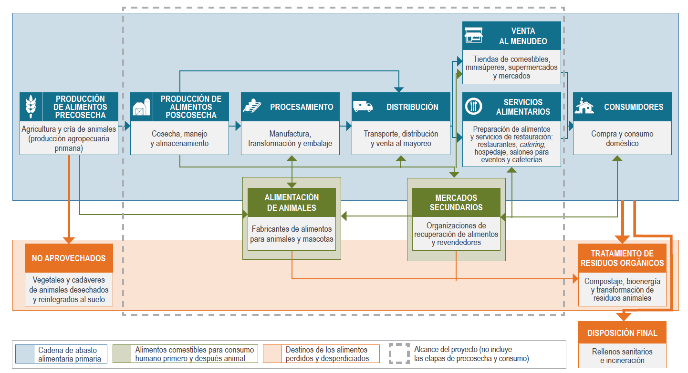
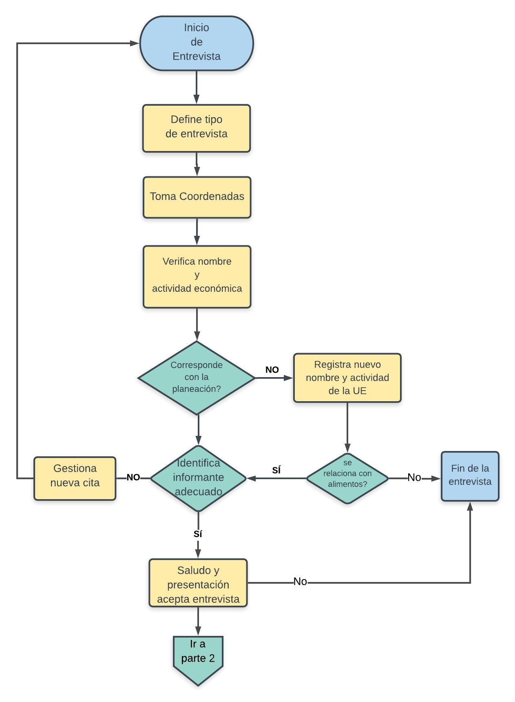
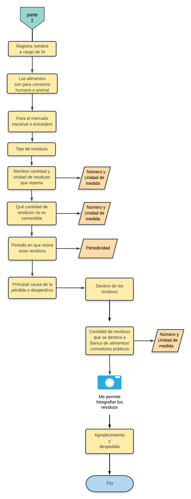

---
title: '**Documento metodológico**'
--- 


<div class=text-justify>

</div>
</br>
</br>
<div class=text-justify>

# **Introducción**

</br>

El Instituto Nacional de Estadística y Geografía presenta la Encuesta de Residuos Alimenticios y Materia Orgánica (ERAMO) cuyo propósito es contribuir a la caracterización y medición de la Pérdida y Desperdicio de Alimentos (PDA) mismo que se ha convertido en un problema mundial y nacional debido a la cantidad de alimentos que se pierden en la cadena de abasto alimentaria, por el impacto social, económico y ambiental que representa. De acuerdo con estudios de la Organización de las Naciones Unidas para la Agricultura y la Alimentación (FAO) así como del Instituto de Recursos Mundiales (WRI), se estima que a nivel mundial, un tercio estimado de toda la comida se pierde o se desperdicia al pasar de donde se produce a donde se consume; teniendo importantes impactos económicos, sociales y ambientales.

En relación a los recursos naturales, los alimentos perdidos y desperdiciados a nivel mundial consumen una cuarta parte de toda el agua utilizada anualmente por la agricultura, requiere un área de cultivo del tamaño de China y genera un estimado de 8% de las emisiones globales de gases de efecto invernadero (WRI, 2016). De hecho, si los alimentos perdidos y desperdiciados fueran un país, sería el tercer emisor de gases de efecto invernadero más grande del planeta, solo detrás de China y Estados Unidos.

La organización de las Naciones Unidas (ONU) ha volteado su mirada hacia este problema y ha propuesto incluir entre los Objetivos de Desarrollo Sostenible (ODS) especialmente en la meta 12.3 la invitación a reducir a la mitad el consumo mundial de alimentos per cápita a nivel minorista y de consumo y reducir las pérdidas de alimentos a lo largo de las cadenas productivas y de suministro (incluidas las perdidas postcosecha) para 2030.

El INEGI está trabajando el tema desde la perspectiva de los impactos ambientales y de los recursos naturales. Nuestro interés es contribuir al cálculo del impacto ambiental y socioeconómico que resulta de la pérdida y desperdicio de alimentos y materiales orgánicos, mediante la generación de información estadística y geográfica veraz y oportuna con la finalidad de apoyar a los tomadores de decisiones en la elaboración de políticas públicas sobre recursos naturales, energía y el medio ambiente en general. 

La Encuesta de Residuos Alimenticios y Materia Orgánica (ERAMO) inaugura un nuevo tema de estudio para el instituto, para ir a todas las etapas de la cadena de abasto alimentaria y recabar información que contribuya a la medición del fenómeno para contribuir a una política nacional encaminada al fomento de su reducción, así como la recuperación de alimentos y el reciclaje de desechos alimentarios.

La ERAMO es un proyecto que impulsa la Dirección de Estadísticas del Medio Ambiente, perteneciente a la Dirección General de Geografía y Medio Ambiente del INEGI, mediante el cual se pretende captar información sobre las cantidades de residuos de alimentos que se pierden y desperdician desde el momento posterior a la cosecha y crianza de los animales hasta la etapa de venta al menudeo y la etapa de servicios alimentarios (preparación de alimentos y servicios de restaurantes, hospedaje, salones para eventos, cafeterías, etcétera) hasta la etapa de venta al menudeo y la etapa de servicios alimentarios. Además, incluirá otros tipos de materia orgánica, consistente en residuos orgánicos como, por ejemplo, la recolección de aquella materia vegetal que resulta de la poda y limpia de parques y jardines a cargo del servicio de limpia público.

La encuesta está dirigida a identificar la **pérdida** de alimentos, entendida como aquellos alimentos destinados al consumo humano que, debido al mal funcionamiento de los sistemas de producción y distribución de estos, disminuyen en cantidad o calidad. La causa primordial de la pérdida de alimentos se puede identificar con la cadena de abasto alimentaria; por ejemplo, alimentos que se pudren en el campo o en bodegas debido a manejo, tecnología o refrigeración inadecuados, o alimentos que no llegan al mercado a causa de una infraestructura deficiente y que por lo tanto no se consumen.

Se pretende caracterizar también el **desperdicio** de alimentos, entendido como aquellos alimentos para consumo humano que se desechan (partes tanto comestibles como no comestibles) de manera intencional. A menudo, el desperdicio de alimentos se refiere a lo que sucede a lo largo de la cadena alimentaria desde la tienda de venta al menudeo hasta el punto de consumo propuesto. El desperdicio de alimentos muchas veces se debe a decisiones como el mal manejo de las existencias o a descuidos, e incluye alimentos descompuestos, caducos o que no se consumieron una vez preparados.

En algún momento las variaciones entre las definiciones de pérdida y desperdicio de alimentos desaparecen. La diferencia principal estriba en que la pérdida tiende a centrarse en las etapas iniciales de la cadena de abasto alimentaria (es decir, producción y procesamiento de alimentos), mientras que el desperdicio de alimentos se concentra sobre todo en las etapas finales de la cadena (es decir, distribución, venta al menudeo, servicios de preparación de alimentos y consumo). El INEGI pretende junto con instituciones, organizaciones y la academia, definir los mecanismos para captar la información necesaria que de soporte a las iniciativas en curso y las que vienen para abordar y ofrecer soluciones a este problema nacional y mundial.

<br>

**Agua**

Entre los efectos ambientales que resultan de la pérdida y desperdicio de alimentos, se encuentra el tema del agua, que se debe analizar al menos en dos niveles: el consumo de este recurso para la producción de alimentos y como residuos que terminan en los ríos y cuerpos de agua, además de los propios mantos freáticos. Aprovechar de manera eficiente los alimentos y sus residuos evita que se contaminen las aguas superficiales y subterráneas, lo que a su vez resulta en beneficio de la conservación del agua potable.

En algunos países se ha comprendido la importancia de un manejo apropiado de los residuos orgánicos y alimentarios, así por ejemplo algunos estados de Norteamérica han prohibido la disposición final de éstos y les obliga a definir metas de aprovechamiento para evitar que lleguen a los sitios de disposición final. Entre los aprovechamientos se pueden mencionar, a la Universidad Purdue (Indiana) donde los desechos alimentarios se recolectan del campus y se envían a plantas de tratamiento de aguas residuales para codigestión, lo que contribuye a la generación de electricidad para la planta de tratamiento.

Existe una creciente necesidad de contar con información oficial que, de respaldo a la toma de decisiones de política pública sobre la cantidad de alimentos y residuos orgánicos generados, así como el aprovechamiento de éstos en toda la cadena alimentaria, en México, Estados Unidos y Canadá. Entre ellos los que tienen que ver con la presencia de residuos orgánicos en las aguas residuales, así como las que resultan de las plantas de tratamiento de esas aguas.

<br/>

<p align="center"> **Consumo de agua en los países de América del Norte** </p>

<br/>


```{r agua1, echo=FALSE, out.width= "60%",warning=FALSE}
library(kableExtra)
agua1 <- read.csv("agua.csv", encoding = "UTF")
names(agua1) <- c( "PAÍS / REGIÓN", "CONSUMO DE AGUA (MILES DE MILLONES DE METROS CÚBICOS)")

kableExtra::kable(agua1, align = c('l','r')) %>%
 kableExtra::kable_styling(bootstrap_options = c("striped", "hover"))

```  
*Fuente: [Kummu et al.(2012), _Lost food, wasted resources: Global food supply chain losses and their impacts onfreshwater, cropland, and fertiliser use_, Science of the Total Environment 438 (2012) 477–489](pdfs/kummu_2012.pdf){target="_blank"} 
</br>
</br>

La pérdida y desperdicio de alimentos conllevan un derroche de recursos naturales invertidos para que sea posible su producción, no solo se trata del suelo o fertilizantes, sino también del agua que se necesitó para su desarrollo, como se aprecia en el cuadro anterior, más de 17 millones de metros cúbicos al año fueron utilizados en la producción de alimentos que terminaron en la basura o las aguas residuales.

</br>

**Suelos**

Los impactos que genera la cantidad de residuos orgánicos que llegan a los sitios de disposición final municipales y privados en México, tiene que ver no solo con las emisiones de metano, pues la composición de los residuos puede llegar a ser de hasta 50% de orgánicos en este tipo de sitios, lo que significa que la superficie y espacio de los suelos destinada para recibir los residuos municipales se debe al menos por lo que toca a la mitad del problema a los residuos de tipo orgánico.
De acuerdo con el informe Huella del despilfarro de alimentos, de la FAO (2013), entre los impactos al ambiente que resultan de la cadena alimentaria, desde su producción hasta la pérdida y desperdicio de alimentos, podemos encontrar: millones de hectáreas de tierras de cultivo desperdiciadas; millones de toneladas de fertilizantes aplicados; millones de m3 de espacio ocupado en rellenos sanitarios; millones de dólares estadounidenses (USD) pagados en tarifas por descarga o depósito de desechos; millones de USD en concepto de pérdida de biodiversidad, y billones de kilocalorías (kcal = 1,000 calorías) en posible pérdida de energía.

En la cadena alimentaria, el momento de la producción de alimentos se caracteriza por ser el de mayor exposición para la pérdida de alimentos, pues son muchos los factores que inciden para que ello suceda y van desde la semilla, los abonos, las plagas y enfermedades de los cultivos, la tecnología, forma de producción, monocultivo, tipo de intercalado, el clima, estándares de calidad y los precios de mercado, sólo por mencionar algunos. Las pérdidas pueden ser parciales o totales y generalmente se cuantifica por toneladas y pueden ser de desde decenas hasta miles de ellas. 

El suelo juega un papel importante en la cantidad y calidad de los alimentos producidos, pues la erosión, salinización, reducen la capacidad de los suelos para el intercambio de nutrientes con los cultivos. [Estimaciones de la FAO del año 2015](http://www.fao.org/news/story/es/item/357165/icode/){target="_blank"}, indican que se pierden aproximadamente 7.6 millones de toneladas de producción de cereales por estas causas. El reto para el año 2050 no sólo es producir más alimentos para la creciente población mundial sino, además evitar que cerca de 1.5 millones de kilómetros cuadrados de tierras agrícolas se pierdan por causa de la erosión.

</br>

**Gases de Efecto Invernadero**

Un tema fuertemente vinculado a pérdida y el desperdicio de alimentos es la generación de metano que es uno de los gases de efecto invernadero (GEI), una de las fuentes importantes de este gas es la que resulta de la descomposición de los residuos orgánicos en los sitios de disposición final de los residuos sólidos urbanos municipales. La Comisión de Cooperación Ambiental para América del Norte (CCA) estima que los tres países que son parte del TLCAN generan el equivalente a 200 millones de toneladas de CO2 aproximadamente, al año de GEI.

Los tres países de américa del norte han generado información sobre la cantidad de emisiones de gases de efecto invernadero que resultan de los rellenos sanitarios ubicados en sus territorios, con el objetivo de cumplir con el compromiso de la Convención Marco de las Naciones Unidas sobre el Cambio Climático (CMNUCC), se trata de estimaciones relativas a las emisiones de GEI usando metodologías aprobadas por el Panel Intergubernamental sobre el Cambio Climático (IPCC).

<br/>

<p align="center"> **Emisiones anuales estimadas de GEI procedentes de la disposición final de residuos orgánicos** </p>

<br/>


```{r gei1, echo=FALSE, out.width= "60%",warning=FALSE}
library(kableExtra)
gei1 <- read.csv("emisiones.csv", encoding = "UTF")
names(agua1) <- c( "PAÍS", "EMISIONES")

kableExtra::kable(agua1, align = c('l','r')) %>%
 kableExtra::kable_styling(bootstrap_options = c("striped", "hover"))

```  
*Nota:  Es probable que las emisiones provenientes de la gestión de residuos orgánicos en México sean considerablemente más elevadas que las mostradas en este cuadro. No obstante, resulta complicado obtener estimaciones confiables de tales emisiones, debido a la falta de información coherente y confiable, así como al elevado número de rellenos sanitarios y vertederos a cielo abierto que operan sin ningún tipo de control en México*

<br>

*Fuente: [CCA (2017), _Caracterización y gestión de los residuos orgánicos en América del Norte, informe sintético_, Comisión para la Cooperación Ambiental, Montreal, 52 pp](pdfs/11770-characterization-and-management-organic-waste-in-north-america-white-paper-es.pdf){target="_blank"} 

</br>
</br>

La cuantificación de la materia orgánica que se genera, así como la cantidad de ésta que se pierde o desperdicia en toda la cadena alimenticia, es útil para la medición del impacto ambiental que genera su descomposición y conversión en GEI. Para reducir y eventualmente evitar que lleguen los residuos orgánicos a los sitios de disposición final, es de mucha utilidad caracterizar el tipo, origen y causa del desecho o desperdicio para elaborar políticas o programas de reducción desde la fuente. Es en este contexto que la ERAMO puede jugar un papel importante para contar con información sobre el tipo de residuos y las razones para su no consumo o reutilización. 


</br>
</br>

# **1. Objetivos**  

</br>

## **General:**  

Contribuir al cálculo del impacto ambiental y socioeconómico que resulta de la pérdida y desperdicio de alimentos y materiales orgánicos, mediante la generación de información estadística y geográfica veraz y oportuna con la finalidad de apoyar a los tomadores de decisiones en la elaboración de políticas públicas sobre recursos naturales, energía y el medio ambiente en general.

## **Específicos:**

Medir y georeferenciar la pérdida y el desperdicio de alimentos que se generan en la cadena de abastecimiento, desde el momento de la postcosecha en el campo, hasta la etapa de venta al menudeo y servicios alimentarios (preparación de alimentos y restaurantes, hospedaje, cafeterías, etcétera). Lo que permitirá ubicar espacialmente la diversidad cultural alimentaria de nuestro país.

Publicar los resultados de la encuesta para que los tomadores de decisión, públicos y privados utilicen los datos para la prevención, aprovechamiento, reciclaje o composteo, así como el mejoramiento de los procesos productivos, hábitos de consumo, a través de acciones privadas o mediante políticas públicas en torno a este tema.

</br>
</br>

# **2. Antecedentes**  

</br>

En la segunda década de este siglo, ha cobrado relevancia el tema de la Pérdida y Desperdicio de Alimentos, desde las perspectivas, social, económica y de la seguridad alimentaria. Esfuerzos como los de la Foro de Bienes de Consumo (CGF), la Organización de las Naciones Unidas para la Agricultura y la Alimentación (FAO), el proyecto FUSIONS financiado por la Unión Europea, el Programa de las Naciones Unidas para el Medio Ambiente (PNUMA), el Consejo Mundial de Empresas para el Desarrollo Sostenible, el WRAP (Programa de Acción de Residuos y Recursos), así como el Instituto de Recursos Mundiales (WRI) la Comisión para la Cooperación Ambiental de América del Norte(CCA), Comisión Ecocómica para América Latina y el Caribe (CEPAL) y de instituciones en México, públicas y privadas han derivado en importantes aportes conceptuales y metodológicos para el abordaje de este problema.

El Protocolo de Pérdida y Desperdicio de Alimentos (Protocolo de PDA) es una asociación de actores que desarrollaron el Estándar Global de Contabilidad y Reporte de Pérdida y Desperdicio de Alimentos (o Estándar de PDA) para cuantificar alimentos y/o partes no comestibles (denominado comúnmente "pérdida y desperdicio de alimentos" y abreviado como PDA).

A principios de 2014 dos grupos técnicos de trabajo del Protocolo de PDA  hicieron el primer borrador para la cuantificación de la PDA en las porciones por un lado en la cadena de suministro de alimentos (desde la cosecha hasta el procesamiento) y por otro lado el grupo de trabajo técnico centrado en la cuantificación de la PDA en la cadena alimentaria. En conjunto, estos dos Grupos Técnicos de Trabajo comprendieron a más de 80 expertos de diversos negocios, agencias gubernamentales, agencias intergubernamentales, organizaciones no gubernamentales e instituciones académicas de más de 25 países y seis continentes.

En el año 2016, la CCA en su plan de trabajo para los años 2017-2018, se propuso invitar a participar del proyecto a otros órdenes entidades de gobierno, grupos indígenas, comunidades locales, expertos, sector privado, sociedad civil. Posteriormente, durante el año 2017, esa comisión elaboró dos diagnósticos, uno referido a la “Caracterización y gestión de la pérdida y el desperdicio de alimentos en América del Norte” y otro en el que se hace una “Caracterización y gestión de los residuos orgánicos en América del Norte”.

En México, el Senado de la República, con fecha de abril de 2018, aprobó el Proyecto de Decreto, por el que se expide la Ley General del Consejo Nacional para el Aprovechamiento de Alimentos; para, posteriormente, remitir el expediente a la Cámara de Diputados. En el Artículo 1 de este proyecto de decreto, se establece que dicha ley es de orden público e interés general, y tiene por objeto la creación del Consejo Nacional para el Aprovechamiento de Alimentos, el cual formulará la política nacional para la reducción del desperdicio y pérdida de alimentos en el país, así como para el aprovechamiento eficiente de los mismos.

El INEGI es parte del Grupo de Trabajo Único sobre la Pérdida y Desperdicio de Alimentos en un intento de sumarse a esfuerzos conjuntos en la materia. En agosto del 2018 se presentó en un grupo interdisciplinario de la cámara de diputados un documento que el Banco Mundial elaboró sobre los lineamientos estratégicos para atender esta problemática. 

En el año 2019 el Instituto inicia trabajos de investigación sobre este tema, a través de la Dirección de Estadísticas del Medio Ambiente, perteneciente a la Dirección General de Geografía y Medio Ambiente. Los trabajos realizados se ubican en la investigación de información existente; detección de necesidades, definición de un marco conceptual, recursos informáticos, materiales y humanos para la consecución de información; identificación de variables y conceptos; diseño de cuestionario; pruebas de captación e intercambio de datos con servidores; definición de la plataforma informática; diseño de muestra y diseño de operativo de campo entre otros aspectos que se abordan en este documento.

En abril de 2019, inicia por parte del INEGI la exploración de un software para encuestas del Banco Mundial, desarrollado como un bien público, esto es, un sistema sin costo para adquirir y que nos podría dar una funcionalidad robusta y estandarizada en la captación de información. 

</br>
</br>

# **3. Documentación de necesidades**

</br>

Actualmente existen estudios que hacen medición o estimación del desperdicio y pérdida de los alimentos, así como de los residuos de parques y jardines, públicos y privados pero que requieren de un respaldo estadístico de mayor envergadura, en un esfuerzo nacional que recupera las distintas realidades de nuestro vasto territorio y diversidad cultural. Lograr la cuantificación de la materia orgánica, es un área de oportunidad para buscar reducir su presencia en los sitios de disposición final para reducir las emisiones de metano mediante el aprovechamiento y procesamiento de esos residuos, así como “concientizar respecto de prácticas óptimas y opciones de políticas con el fin de fomentar el desvío y procesamiento de residuos orgánicos” CCA (2014).

Se hace necesario contar con datos más certeros de lo que la Pérdida y Desperdicio de Alimentos representa en términos de la disposición final de estos residuos orgánicos, ya que al descomponerse generan emisiones de gases de efecto invernadero, que afectan la calidad del aire; por lo que la CCA tiene estimaciones de las emisiones anuales de estos gases, en Estados Unidos, Canadá y México y estas representan: 148, 26 y 21.5 millones de toneladas métricas equivalentes a CO<sub>2</sub> respectivamente.Así como, se calcula qu eel tiempo de residencia en la atmósfera del metano, es de cerca de doce años, sin embargo se requieren datos más precisos del volumen generado en particular para el caso de México.

En México no existe información oportuna y recurrente respecto de la pérdida y desperdicio de alimentos, que puede servir de base para desarrollar estrategias y priorizar acciones para prevenir la pérdida y el desperdicio de alimentos, a la vez que puede ser útil para identificar el uso más productivo de la PDA entre los entes que proporcionen la información en un ejercicio de retroalimentación para los informantes. Diversos métodos de cuantificación se hacen necesarios, en el caso del instituto, se pone a disposición, el conocimiento y experiencia que se tienen para incurrir por el camino de las encuestas como método de contribución a la medición del problema.

Diversas instituciones nacionales e internacionales del medio ambiente, Turismo, Agricultura, Ganadería, Desarrollo Rural, Pesca y Alimentación, así como de la Comisión Nacional de Acuacultura y Pesca, el Servicio Nacional de Sanidad, Inocuidad y Calidad Agroalimentaria, la Agencia de Servicios a la Comercialización y Desarrollo de Mercados Agropecuarios, Diconsa y el Servicio de Información Agroalimentaria y Pesquera. Banco Mundial, FAO, CCA, WRI, entre muchas otras han estado trabajando en estudios e investigaciones de gran utilidad que requieren concreción en un sistema o sitio de consulta y actualización de la información que sea soporte de las estrategias y políticas públicas que se adopten.

</br>
</br>

# **4. Importancia de la estadística por generar con la ERAMO**

</br>

Debido a la importancia de la información generada por la ERAMO, se aspira a que sea considerada Información de Interés Nacional; para lo cual, se atenderá lo dispuesto en las denominadas Reglas para la determinación de información de interés nacional, aprobadas por la Junta de Gobierno del INEGI y publicadas en el Diario Oficial de la Federación (DOF) el 9 de abril de 2018; dichas reglas señalan cuatro criterios, el primero ya se cumple, debido a que la ERAMO se encuentra dentro del tema de residuos sólidos; mientras que, el segundo criterio, también se considera que aplica, ya que resulta necesaria para sustentar el diseño y la evaluación de las políticas públicas de alcance nacional. Además, también se podrían cubrir el tercer y cuarto criterios, que indican que la información sea generada en forma regular y periódica, así como que se elabore con base en una metodología científicamente sustentada.

El impacto del crecimiento mundial estimado para 2050 en más de 9 mil millones de personas, se requerirá aumente en un 70% la producción actual de alimentos que requerirían ampliar de casi 1 400 millones de hectáreas a más de 1 600 en el mismo lapso de tiempo a costa de los recursos naturales como son los suelos con vegetación, agua y ecosistemas en general.

En Canadá, Estados Unidos y México, los residuos orgánicos se depositan de manera predominante en rellenos sanitarios, basureros y tiraderos a cielo abierto, a decir de la propia CCA, lo que resulta en una alta concentración de emisiones de metano, que si no son capturados y quemados o utilizados para producir electricidad, son liberados al aire, con los consecuentes daños al ambiente, pues ese gas es un contaminante de vida corta precursor del cambio climático y un gas de efecto invernadero, 25 veces más potente que el dióxido de carbono. Identificar las fuentes de origen de esos residuos debe servir para proponer medidas que reduzcan de origen la causa de las emisiones.

Al identificar y caracterizar los residuos alimenticios y otros residuos orgánicos, así como sus posibles destinos, tales como composteo, alimentación humana por medio de los bancos de alimentos, alimentación animal, biomaterial, codigestión anaerobia, etcétera; se podría contribuir a las políticas económicas para la generación de empleos.

Según la CCA, la pérdida y el desperdicio de alimentos (PDA) es un tema que cobra cada vez mayor relevancia en Canadá, Estados Unidos y México, países donde anualmente se pierden y desperdician —en toda la cadena de abasto alimentaria, incluidas las etapas de precosecha y consumo— casi 170 millones de toneladas de alimentos producidos para consumo humano. Los desechos alimentarios que van a parar a rellenos sanitarios generan enormes cantidades de metano, gas de efecto invernadero 25 veces más potente que el dióxido de carbono. La PDA causa también pérdida de biodiversidad y problemas de salud pública.

La preocupación sobre el tema ha involucrado no solo a los gobiernos, sector privado y organizaciones como Save Food, Piensa-Aliméntate-Ahorra, dirigido por la FAO; el PNUMA; Foro de Bienes de Consumo, "Every Crumb Counts (Cada Miga Cuenta)" de Food Drink Europe, el Compromiso Courtauld 2025 en el Reino Unido y la Alianza para la Reducción de Desperdicio de Alimento en los Estados Unidos son ejemplo de la importancia que cobra cada día esta preocupación mundial.
 
</br>
</br>

# **5. Fundamento Legal**  

</br>

La Dirección de Estadísticas del Medio Ambiente pretende realizar una encuesta sobre residuos alimenticios procedentes de la industria alimentaria, de servicios de alimento y de otras fuentes generadoras de residuos orgánicos, como por ejemplo, parques y jardines públicos y privados; a fin de conocer el origen de su generación, cantidad, composición, reutilización, tratamiento y disposición final; con el propósito de generar información valiosa para conocer el fenómeno y facilitar, en lo posible, la toma de decisiones técnicamente sustentadas. Lo anterior está fundamentado en las siguientes disposiciones legales:

</br>
</br>

**Ley del Sistema Nacional de Información Estadística y Geográfica.**

</br>

Sección III

Subsistema Nacional de Información Geográfica, Medio Ambiente, Ordenamiento Territorial y Urbano

ARTÍCULO 27.- El Subsistema Nacional de Información Geográfica, Medio Ambiente, Ordenamiento Territorial y Urbano, en su componente del medio ambiente, procurará describir el estado y las tendencias del medio ambiente, considerando los medios naturales, las especies de plantas y animales, y otros organismos que se encuentran dentro de estos medios.

El Subsistema referido en el párrafo anterior, deberá generar, como mínimo, indicadores sobre los siguientes temas: atmósfera, agua, suelo, flora, fauna, residuos peligrosos y residuos sólidos.

ARTÍCULO 28.- El Instituto elaborará, con la colaboración de las Unidades, los indicadores a que se refieren los dos artículos anteriores a partir de la información básica proveniente de: I. El Sistema Nacional de Información Ambiental y de Recursos Naturales; II. Un sistema integrado de inventarios y encuestas sobre recursos naturales y medio ambiente, y III. Los registros administrativos que permitan obtener Información en la materia.

Reglamento Interior del Instituto Nacional de Estadística y Geografía
ARTÍCULO 26.- Son atribuciones específicas de la Dirección General Adjunta de Recursos Naturales y Medio Ambiente, las siguientes:

1. Desarrollar proyectos de disposiciones normativas para someterlas a consideración del Director General de su adscripción, sobre los procesos de generación, integración, validación y explotación de información sobre recursos naturales y medio ambiente, producida por las Unidades Administrativas del Instituto y demás Unidades del Estado conforme a lo dispuesto en la Ley;

2. Coordinar las actividades de diseño, planeación, levantamiento, tratamiento y procesamiento de la información, la documentación, evaluación y control de calidad de las encuestas o módulos de encuestas, y levantamientos muestrales, sobre el estado de los recursos naturales y el medio ambiente para su integración al Sistema y el programa de planeación territorial;

3. Integrar, con la colaboración de las Unidades del Estado, un sistema de inventarios y encuestas sobre recursos naturales y medio ambiente, cuya información permita la elaboración de indicadores, sobre los siguientes temas: recursos naturales y clima, así como atmósfera, agua, suelo, flora, fauna, residuos peligrosos y residuos sólidos.

**Manual de Organización Específico. Dirección General de Geografía y Medio Ambiente**

Dirección de Estadísticas del Medio Ambiente.

Objetivo.

Coordinar con las Unidades del Subsistema, la generación de las estadísticas básicas y derivadas en materia ambiental de interés nacional, de acuerdo con la aplicación de la normatividad estadística para el diseño, ejecución y evaluación de las políticas públicas sobre medio ambiente y desarrollo sustentable del país.

</br>
</br>

# **6. Unidades de observación para la ERAMO**

</br>

La encuesta está dirigida a los sectores productivos: agricultura, cría de animales, caza y pesca; industria de alimentos y bebidas; transporte y almacenamiento; comercio al por mayor y menudeo; servicios de preparación de alimentos y bebidas, la selección fue hecha con base en el Sistema de Clasificación Industrial de América del Norte 2018. Los hogares están considerados también para ser objeto de la encuesta, al igual que la información proveniente de la recolección de hojas, pastos y ramas producto de la poda de parques y jardines.

Para una mejor comprensión de los momentos de la cadena de alimentos que comprende la encuesta, se citan aquí los conceptos que la CCA considera como objeto de estudio.

- “La producción de alimentos **poscosecha** abarca las actividades poscosecha que se llevan a cabo en la granja y también aquellas que implican cosecha, manejo y almacenamiento de plantas o de animales (ganado, aves, mariscos) o sus partes, pero que se realizan fuera del sector agrícola (adaptado de Grolleaud, 2001).  

- El procesamiento de alimentos es la **transformación** de alimentos crudos en productos aptos para consumo, cocinado o almacenamiento (EUFIC, 2016). El término 'procesamiento de alimentos' equivale a o es intercambiable con 'transformación o fabricación de alimentos'.  

- La **distribución** abarca el transporte y la distribución de productos alimenticios antes de la recepción por el consumidor, e incluye venta al mayoreo e intermediación (adaptado de Perner, 2008).  

- La **venta** al menudeo se refiere a la oferta de alimentos para uso en el hogar en negocios de servicio directo al consumidor (por ejemplo, tiendas o mercados). La venta en restaurantes o en ámbitos institucionales no está incluida en esta etapa (adaptado de Suttle, s.f.).  

- Los **servicios alimentarios** abarcan la preparación de alimentos y los servicios de comida, bocadillos y bebidas para consumo fuera del hogar (o para llevar), en establecimientos formales o de comida rápida y en ámbitos comerciales e institucionales, como restaurantes, salones de eventos, hoteles y cafeterías.” CCA (2017:6)

</br>
</br>

# **7. Método para generar la información estadística para la ERAMO**

</br>

La Comisión de Cooperación Ambiental para América del Norte, decidió usar diversos métodos de medición existentes para la obtención de datos de este tema, entre ellos los diarios o bitácoras de los informantes; la medición directa; entrevistas y encuestas, balance de masas, datos sustitutos o indirectos, registros y el análisis de composición de desechos.  

En el caso de la ERAMO, método definido para la obtención de la información sobre pérdida y desperdicio, es una encuesta a partir de una muestra representativa de todos los sectores de actividad relacionados con los alimentos que para nuestro país incluye alrededor de 180 clases de actividad, que van desde la producción agropecuaria en el sector primario, la transformación de los alimentos en el sector secundario hasta la comercialización y venta de productos en el sector terciario.

Para la organización de la información, se adoptó el Modelo Genérico del Proceso Estadístico (GSBPM por sus siglas en inglés, Generic Statistical Business Process Model), desarrollado por la Comisión Económica de las Naciones Unidas para Europa (UNECE), el cual describe y define el conjunto de procesos necesarios para producir estadísticas oficiales, mismo que provee un marco estándar y una terminología armonizada para ayudar a las organizaciones estadísticas a modernizar los procesos de producción estadística, así como compartir métodos y componentes.

Con el propósito de estandarizar sus procesos, el INEGI llevó a cabo la adecuación de dicho GSBPM, referido al contexto del Instituto, así como su armonización con el marco normativo aplicable al mismo. Resultado de lo anterior, es la Norma Técnica del Proceso de Producción de Información Estadística y Geográfica para el Instituto Nacional de Estadística y Geografía, emitida por la Junta de Gobierno del INEGI en agosto de 2018. Dicha norma se utilizará para la organización de la información que resulte de la ERAMO.

El Instituto de Recursos Mundiales (WRI), quien lidera el proyecto para América del Norte, en su Estándar de Contabilización y Registro de la Pérdida y el Desperdicio de Alimentos (Estándar PDA) (WRI, 2016), describe las dos categorías con sus respectivos métodos más utilizados para cuantificar la PDA; la primer categoría es la Medición o Aproximación, cuyos métodos son: pesaje directo, conteo, evaluación de volumen, análisis de la composición de los desechos, registros, diarios y bitácoras, así como las encuestas; mientras que, la segunda categoría es la Deducción Mediante Cálculo, que incluye los métodos de balance de masas, modelación y datos indirectos o sustitutos. En la ERAMO se empleará el método de encuestas; el cual, a decir del Estándar PDA, permite captar datos sobre cantidades de alimentos perdidos y desperdiciados (APD), así como otro tipo de información (hábitos, actitudes, ideologías, comportamientos, etcétera) en relación con la PDA.

El marco conceptual y metodológico adoptado por la ERAMO es el que la División de Estadística de las Naciones Unidas desarrolló en el año 2013 bajo el nombre de **Marco para el Desarrollo de Estadísticas Ambientales (MDEA 2013)**, que es la versión revisada del FDES/MDEA original publicado en 1984 por esa misma institución. Dentro de los objetivos del MDEA 2013, está contribuir significativamente a la mejora del monitoreo y medición de la dimensión ambiental del desarrollo sostenible; además, de que su uso en sistemas estadísticos nacionales promueve el desarrollo en este campo de las estadísticas, ya que es una herramienta flexible y de usos múltiples que puede ser adaptada para abordar preocupaciones y prioridades específicas de política ambiental de los países, además de poder adecuarse a sus niveles de desarrollo estadístico.

La adopción de este marco conceptual permite abordar temas y aspectos del medio ambiente que son relevantes para el análisis, formulación de políticas y toma de decisiones en las esferas ambiental y social; además de que está diseñado para apoyar a todos los países en la formulación de programas de estadísticas ambientales y de impacto social. En particular de este tema que se vincula con temas como los recursos naturales, energía, producción de alimentos, emisiones y su relación con aspectos sociales como el hambre, distribución de alimentos, producción animal, destino de los recursos, acceso y distribución de los alimentos y destino de la producción. Todos ellos aspectos transversales y vinculados al tema de la seguridad alimentaria nacional y mundial.

# **8. Esquema de la cadena de abasto alimentaria**

</br>

La figura que se presenta a continuación, muestra todas las fases de la cadena alimentaria, desde su producción hasta su consumo en los hogares. Todas las fases son importantes y de un impacto aún no medido y que requieren un trabajo de investigación, en cuanto a la cantidad de alimentos y materia orgánica que pierden o desperdician en cada momento y en su conjunto. Sin embargo, la CCA ha decidido no abordar todas las fases, excluyendo la precosecha y el consumo en los hogares. Sin embargo, para nuestro país cobra relevancia por lo menos en el tema de los hogares, ya que se estima que el porcentaje de residuos orgánicos que termina en los sitios de disposición final oscila alrededor del 50% del total de residuos sólidos urbanos.

</br>

**Panorama general de la cadena de abasto alimentaria**


```{r organicos, fig.align='center', echo=FALSE, out.width = "100%", cache=TRUE}



```
 
</br>
</br>

# **9. Integración del marco conceptual**

</br>

## **9.1 Temas y variables objeto de la encuesta**

</br>

El tema central del que se parte para este trabajo, son los residuos orgánicos como el paragüas que da cobijo a los subtemas de los residuos de alimentos y restos de poda en parques y jardines. Las categorías relacionadas con el subtema en particular de residuos de alimentos son la pérdida y desperdicio de alimentos, mismas están fuertemente vinculadas con aspectos relacionados con la producción de comida y el abasto o suministro suficiente para la población creciente en México y el mundo; en consecuencia, es también un tema de seguridad alimentaria de los países; pero también está relacionado con temas ambientales como las emisiones de metano, los rellenos sanitarios, aguas residuales y alcantarillado, energía, agroquímicos, entre otros.  

Las variables, generalmente pueden identificarse con diferentes criterios, por ejemplo: las cualitativas, asociadas a valores nominales como sexo, o las cuantitativas asociadas a valores numéricos. Para esta encuesta, el tipo y cantidad de residuos alimenticios que se pierden en la cadena productiva, son el centro de atención; el lugar donde son generados y el destino de estos tanto para los residuos de los alimentos, como para las partes que no son comestibles. Se presenta enseguida la tabla que muestra organizados los temas, categorías y variables de estudio.  

**Tema: Residuos orgánicos**

```{r tab2, echo=FALSE, fig.align='left', warning=FALSE}
library(kableExtra)
tab2 <- read.csv("temas_variables_eramo.csv", encoding = "UTF-8" )
names(tab2) <- c("Subtema", "Categoría", "Variable", "Clasificación")
kableExtra::kable(tab2) %>%
  kableExtra::kable_styling(bootstrap_options = c("striped", "hover"))

```


## **9.2 Clasificaciones Internacionales Establecidas para las Clases de Actividad:**

</br>

La Comisión para la Cooperación Ambiental de América del Norte (CCA) utilizó para la organización estudio de sus unidades de observación y de los productos asociados, clasificadores internacionales para las diversas actividades económicas, incluyendo aquellas actividades que producen cantidades significativas de residuos orgánicos (entre ellos los residuos alimenticios), pudiéndose señalar los siguientes:   

	Codex General Standard for Food Additives (GSFA) System or United Nations Central Production Classification (CPC) system.

</br>

<iframe src="pdfs/CXS_192e.pdf" style="width:100%; height:650px;" frameborder="0"></iframe>

</br>

Situado en: http://www.fao.org/gsfaonline/docs/CXS_192e.pdf

</br>

[Global Product Category (GPC) codes (online, o descargado en Excel, Word o copia en XML).](https://www.unece.org/fileadmin/DAM/cefact/cf_forums/2017_Geneva/PPTs/MinConf_Agri__Frug1Com.pdf){target="_blank"}

</br>

[United Nations Standard Products and Services Code (UNSPSC).](https://www.doa.la.gov/osp/Vendorcenter/docs/unspsc_commoditycodes.pdf){target="_blank"}

</br>

[United Nations International Standard Industrial Classifications of All Economic Activities (ISIC)](https://stat.unido.org/content/learning-center/international-standard-industrial-classification-of-all-economic-activities-%2528isic%2529){target="_blank"}

</br>

Existen otros sistemas de clasificación regionales y nacionales; derivados, la mayoría de ellos, del ya mencionado ISIC; al respecto, existe un listado por parte de las Naciones Unidas: The UN Statistics Division Lists National Classification Systems.

México utiliza el Sistema de Clasificación Industrial de América del Norte, 2018 (SCIAN 2018). Antes de ello, se usó el Catálogo Mexicano de Actividades Económicas (CMAE) para los Censos Económicos de 1961, 1966, 1971 y 1976, sustituido por la Clasificación Mexicana de Actividades y Productos (CMAP) para los Censos de 1981, 1986, 1989 y 1994. A partir del acuerdo con el TLC, las dependencias gubernamentales de estadística de Canadá, Estados Unidos y México acordaron elaborar, de manera conjunta, un clasificador de las actividades económicas realizadas en América del Norte.  De este esfuerzo nació el SCIAN, conocido en inglés como “The North American Industry Classification System” (NAICS), cuya versión original es la de 1997. 

</br>

<iframe src="pdfs/SCIAN.pdf" style="width:100%; height:650px;" frameborder="0"></iframe>

<br/>
</br>

# **10. Prueba Piloto para la Captación de Datos**   

</br>

Como parte de los preparativos en el diseño de la encuesta, se establece la necesidad de realizar pruebas piloto, que parten de las necesidades de los requerimientos de la calidad de la información, las poblaciones objeto de estudio y las características de éstas. Las pruebas que se deban llevar a cabo se harán sobre una muestra representativa de cada sector definido para las unidades de observación, mediante una entrevista directa.  

Las pruebas piloto tienen por objetivo observar aspectos de los instrumentos de captación, el contenido de las preguntas, su redacción, secuencia, diseño y distribución, dificultad para captar la información de cada pregunta, así como las instrucciones de llenado. Los aspectos operativos y de estrategia de levantamiento, también son temas para estudiar en una prueba de estas características, por ejemplo: la dificultad para encontrar a los informantes adecuados, el cálculo de tiempos de entrevista, las cargas de trabajo, entre otros aspectos.  

Adicionalmente, se busca explorar la familiaridad de la población entrevistada con el tema de residuos alimenticios y otros residuos orgánicos, así como sus actitudes y conductas respecto al tema, lo que permitirá valorar el funcionamiento de los instrumentos y determinar los ajustes necesarios para el levantamiento definitivo. Se ha diseñado como instrumento auxiliar para la documentación de las actividades antes mencionadas, una guía de observación para el ejercicio de la prueba piloto, donde se plasmarán todas anotaciones y observaciones correspondientes.  

</br>

## **10.1 Sectores de Actividad del SCIAN 2018 seleccionados para la Prueba Piloto** 

</br>

Con base en la metodología de la FAO, los trabajos de investigación de la CCA y de los indicadores ODS para el tema de la pérdida y desperdicio de alimentos, se ha determinado la necesidad de aplicar la ERAMO en la cadena productiva de los alimentos, a partir del momento de la postcosecha; la transformación de los alimentos mediante algún proceso productivo; el transporte de las mercancías hacia los centros de distribución y finalmente en la venta al consumidor final. Como se desprende de esta reflexión, es necesario ir a los tres sectores de la producción para cubrir la temática propuesta.  

A lo anterior se suma la necesidad de recabar información de la pérdida y desperdicio de alimentos en los hogares, como parte final de la cadena de la producción y consumo. La necesidad de alimentar 6 mil millones de personas en el mundo y con la expectativa de crecimiento hasta 10 mil millones para el año 2050, y para México casi 130 millones ahora y con la expectativa de llegar a poco más de 148 millones para el año 2050 de acuerdo con proyecciones de CONAPO, indican de manera clara la necesidad de abordar el tema desde todos los ángulos del problema.  

Finalmente, se decide incluir en esta encuesta, a los residuos orgánicos captados en los parques y jardines que forman parte de la recolección del servicio público, incluye solamente las ramas y pasto derivado de la poda.

</br>

**Sectores y subsectores de actividad considerados en el universo de estudio para la muestra**

```{r tab3, echo=FALSE, fig.align='left', warning=FALSE}

library(DT)
tab3 <- read.csv("marco_muestreo.csv", header = T)
names(tab3) <- c("Clave SCIAN", "Descripción")
DT::datatable(tab3, filter = 'top', options = list(
  pageLength = 10, autoWidth = TRUE, scrollX = TRUE,
  fixedColumns = TRUE, language = list(
    info = "Mostrando registros del _START_ al _END_ de un total de _TOTAL_ registros",
    paginate = list(previous = 'Anterior', `next` = 'Siguiente'),
    search =  "Buscar:", lengthMenu = "Mostrar _MENU_ registros" )
  ))

```

</br>
</br>

# **11. Estructura Operativa**

</br>

## **Levantamiento nacional de la ERAMO en el año 2021**

Para la atención de la encuesta, la organización del personal se divide en dos grupos: la estructura central que coordina y dirige el operativo y la estructura estatal que aplica los cuestionarios en las unidades de muestreo seleccionadas.

**Estructura Central:**

•	Un equipo de oficinas centrales que coordinará el operativo, el cual está formado por un coordinador, supervisores, instructores y observadores.

•	La figura del instructor se encargará de capacitar a las figuras operativas como el entrevistador, observador y el supervisor, en oficinas centrales, así mismo se encarga de dar la capacitación a las estructuras operativas de las entidades federativas.

•	Un equipo para el procesamiento de la información.

•	Un equipo responsable de la publicación de la información.

**Estructura Estatal**

•	Un equipo de trabajo (entrevistadores) por cada entidad federativa. Al igual que en oficinas centrales, las figuras antes mencionadas estarán formando parte de la estructura operativa, para cada entidad federativa.

</br>

## **Prueba piloto en las tres principales zonas del país, en el año 2020**

La estructura operativa para esta prueba a realizarse en 2020, será igual que la descrita en el apartado anterior, con la única diferencia de que el número de entidades donde se realizará la prueba es de 3: Ciudad de México, Jalisco (Zona Metropolitana de Guadalajara), y Nuevo León (Zona Metropolitana de Monterrey). 

</br>

## **Prueba piloto en Aguascalientes 2019**

Se conforma de cuatro equipos de trabajo, con integrantes de la Subdirección de Acopio. 
Cada equipo de trabajo consistirá de los siguientes roles o responsabilidades:

•	Dos entrevistadores, los cuales a su vez fungen como observadores, intercambiándose entre dichos roles para cada entrevista realice. 

•	Un supervisor de campo, quien se encargará no sólo de verificar que se concreten las entrevistas necesarias, sino será también quien se encargue de la logística de campo de su equipo.

Adicionalmente, otro equipo de control se encargará de validar, procesar y generar los resultados de la información captada.

</br>
</br>

# **12. Muestra**

</br>

## **Levantamiento nacional de la encuesta en 2021**

</br>

La muestra ha de ser probabilística, bietápica, por conglomerados y estratificada, basándose en el marco de muestreo del SCIAN (Sistema de Clasificación Industrial para América del Norte 2018) correspondiente a las clases de actividad de interés (ver apartado 3.1). El tamaño de la muestra ha de definirse usando como variable de diseño la existencia de residuos de alimentos comestibles destinados a basura o alcantarillado, dentro de la unidad de observación.

Los parámetros de diseño de la muestra (efecto de diseño, porcentaje de no respuesta, variables estratificadas) para el levantamiento definitivo, se obtendrán de los resultados de las dos pruebas piloto que se harán previamente.

Las expresiones para los estimadores y varianzas serán las de un estimador de Horvitz-Thompson, con sus respectivos intervalos de confianza para un nivel de 90%.

La cobertura geográfica será nacional y se podrán obtener estimaciones a nivel de entidad federativa.

</br>

## **Prueba piloto en las tres principales zonas del país, en el año 2020**

</br>

La muestra ha de ser probabilística, bietápica, y estratificada, basándose en el marco de muestreo del SCIAN de interés. Los conglomerados naturales serán las tres zonas metropolitanas de interés: Cd. de México, Guadalajara y Monterrey.

El diseño muestral será idéntico para las 3 ciudades y se tomará una muestra de 150 unidades por ciudad. Se ha diseñado ya a modo de ejemplo una muestra para la ciudad de Guadalajara cuyos detalles pueden consultarse [aquí](muestra_eramo_2020/index.html){target='_blank'}

</br>

## **Prueba piloto en Aguascalientes 2019**

</br>

La muestra será determinística, basándose en el marco de muestreo de interés, proveniente del SCIAN, pero seleccionando solamente algunas de las claves de los sectores de actividad con mayor representatividad en Aguascalientes:

</br>


```{r tab4, echo=FALSE, fig.align='left', warning=FALSE}
library(kableExtra)
tab4 <- read.csv("muestra_eramo_casera_ags/scian_ags_eramo.csv", header = T )
names(tab4) <- c("Código / Descripción", "unidades de observación en Aguascalientes")
kableExtra::kable(tab4) %>%
  kableExtra::kable_styling(bootstrap_options = c("striped", "hover"))

```

</br>

Como resultado se obtiene una [**muestra de 105 unidades de observación**](muestra_eramo_casera_ags/muestra_ags_01.xlsx), distribuida según el siguiente [**mapa**](https://www.google.com/maps/d/u/0/edit?mid=1xlYOnk1zJWtd-YY-LA6NqdCnfCo4AEUu&ll=21.980741557737424%2C-102.48334095000001&z=11){target='_blank'}.

Adicionalmente, se aplicará el cuestionario a 20 viviendas y al menos 10 propietarios de terrenos de siembra en localidades rurales dentro de la zona de estudio.

</br>
<br>

# **13. El procedimiento de captación**

</br>

El flujo del procedimiento de captación se encuentra resumido en el siguiente diagrama:

</br>

```{r cuestionario1, fig.align='center', echo=FALSE, out.width = "100%", cache=TRUE}



```


```{r cuestionario2, fig.align='center', echo=FALSE, out.width = "100%", cache=TRUE}



```

<br>
</br>

## **13.1 Aplicación en dispositivos móviles (celulares)**

</br>

La plataforma tecnológica utilizada se encuentra disponible en el sitio [https://mysurvey.solutions/](https://mysurvey.solutions/){target='_blank'}. Se trata de una aplicación abierta y gratuita desarrollada por el Banco Mundial para el desarrollo de encuestas. La aplicación tiene muchas funcionalidades, como la posibilidad de incluir toma de coordenadas GPS para georreferenciar las unidades de observación, capturar fotografías, incluir validaciones, filtros y pases entre preguntas, entre otras herramientas.

La aplicación puede adaptarse a teléfonos celulares, como en el caso de la prueba piloto en Aguascalientes, así como a otros dispositivos, como tablets, o bien para captación vía web (entrevistas por internet). La forma en que funciona la aplicación en un teléfono celular se muestra en el siguiente video:

<div class=text-center>

<video width="50%" height="50%" controls>
  <source src="videos/VideoLlenado.mp4" type="video/mp4">
</video>

</div>

<br>


## **13.2 Los controles de captación**

</br>

La Encuesta es una técnica de investigación que permite recolectar información estadística actualizada, oportuna y pertinente de temas diversos y específicos a una parte o fracción de la población en estudio, la cual se denomina muestra. Con la información que se capta en las encuestas se obtiene información generalizada por lo que el INEGI no publica datos que hagan referencia a situaciones particulares.

Existe una base de datos de la muestra determinada en oficinas centrales; cada elemento tiene un ID definido previamente; al momento de la aplicación. Cuando por alguna razón, al momento de la aplicación, no se encuentre la unidad de muestreo, se aplicará el siguiente procedimiento:

Se registra en el cuestionario el código de resultado de la entrevista (aplazado, no se encontró al informante, negativa, cambio de domicilio, cerrado definitivamente), se anota la mayor cantidad de datos posibles que expliquen la situación encontrada y se continúa con la siguiente entrevista asignada.

Oficinas centrales define el procedimiento a seguir (sustitución de la unidad de muestreo o mantiene el estatus del resultado de la entrevista), se aplican criterios de validación a la información, se clasifica, se publica y si es apta se elabora un tabulado, gráfica y /o mapa.

</br>
</br>

# **14. Procesamiento**

</br>

El procesamiento de datos es la fase en la que se analiza la información captada, ya sea que se obtuvo mediante entrevistas directas, auto llenado, respuestas en línea, entre otros medios; el resultado de ello siempre será una base de datos. En la fase de procesamiento, las bases de datos son analizadas mediante diversas herramientas que fueron elaboradas para ese propósito desde la fase de Diseño de la encuesta.

El propósito en esta fase es preparar la información mediante acciones como la codificación, validación y eventualmente imputación de valores para que la información pueda ser publicada. Se pueden adicionar o construir nuevas variables, ponderadores, unidades o agregados para preparar las bases de datos validadas.

Este es el momento en que se integran los datos y se validan a través de procedimientos establecidos previamente, con el propósito de identificar los casos que deben ser verificados manual o automáticamente; la identificación de problemas potenciales, errores o discrepancias derivados por ejemplo de la no respuesta, valores atípicos o una mala codificación.

El caso de nuestra encuesta se enfrenta a la necesidad de crear ponderadores para lograr que la muestra sea representativa de la población objetivo, por tanto, esta fase debe considerar las propuestas de ponderación elaboradas en la fase de Diseño, para la normalización de los datos.

</br>

## **14.1 Organización para el procesamiento** 

</br>

La fase de procesamiento de la información nace en el diseño de la encuesta y se prolonga hasta la etapa posterior al levantamiento de la información y tiene como propósito darle certeza y seguridad a la calidad de los datos captados, a efecto de crear las condiciones para que la información esté lista para su publicación y puesta a disposición de los usuarios de nuestros datos.

Los dos momentos clave del procesamiento tiene al menos como actividades al interior, las siguientes:

**Diseño:**

• Estrategias y sistemas de captura y codificación.  
• Estrategias y sistemas de validación.  
• Sistema de integración y explotación.  
• Manuales e instructivos.  
• Pruebas.

**Ejecución:**

• Captura y codificación.  
• Integración de la Base de Datos.  
• Validación.  
• Explotación.

</br>

## **14.2 Procesamiento de datos**

</br>

### **Captura y codificación.** 

Una de las ventajas de realizar las entrevistas en dispositivos móviles es la de evitar un proceso de captura manual de cuestionarios. Los datos que se ingresan al sistema van directamente a un respaldo en el repositorio web de la aplicación, y al final del levantamiento pueden ser descargados en una base de datos en varios formatos para su procesamiento.

Dado que en la prueba piloto no se espera un volumen muy grande de entrevistas, la codificación que se requiera para ciertas variables, puede hacerse manualmente. La principal variable de interés que se captará de manera abierta será la que capta la causa por la que se producen los residuos. Las variables de especificación de las opciones de respuesta "Otro" servirán para observar qué respuestas pueden obtenerse, pero difícilmente podrán codificarse.

</br>

### **Validación e integración de bases de datos**  

La validación es la etapa del procesamiento en la que se depura la información proveniente de campo para evitar posibles inconsistencias. Previamente, se analizan los criterios de validación y se programan las rutinas que validan la información en cuanto a integridad, omisiones, rangos válidos y congruencia básica, con el objetivo de garantizar el cumplimiento de los parámetros de calidad requeridos.

Los criterios de validación también se utilizan para identificar las fuentes probables de error en la captación, una de las cuales puede ser el diseño del cuestionario, de manera que puedan ser eliminadas en proyectos posteriores, por ejemplo, una alta tasa de no respuesta en determinada pregunta.

Entre los indicadores de error que pueden revisarse se encuentran los siguientes:

•	Porcentaje alto de no respuesta, especialmente las negativas.  
•	Porcentaje alto de respuestas ilógicas.  
•	Porcentaje alto de incongruencias entre preguntas relacionadas.  

La integración de la base de datos sólo deberá hacerse con aquellos cuestionarios que adquieran el estatus de validados, para garantizar que la información que se analice sea lo más confiable posible.  

La aplicación del dispositivo móvil ya contiene de entrada la posibilidad de incluir validaciones básicas entre variables, a saber:

1. Omisiones    
2. Rangos válidos    
3. Congruencias entre cantidades de residuos declarados    
4. Congruencias entre unidades de residuos, por ejemplo, no poder mezclar litros con kilogramos    
5. Congruencias entre tipos de residuos no comestibles y destino como banco de alimentos

Entre otras consistencias incluidas. La validación central comprende una serie de algoritmos de corrección de datos considerados erróneos, la cual, se está desarrollando actualmente.

</br>

### **Análisis del procesamiento**

Tiene por objeto asegurar que la información producida es apta para su propósito, es decir, está lista para su uso y difusión, para lo cual se debe hacer un cálculo de todos los indicadores de calidad vigentes asociados a la información y los resultados; comprobar que la cobertura de la población y las tasas de respuesta son las requeridas y que no haya sesgos o falta de cobertura derivado de estos aspectos; documentar los diferentes tipos de errores, así como validar los resultados en comparación con las expectativas y la información existente.

Resguardar y conservar la información y asegurar que los datos y metadatos que se difundirán observen los principios de confidencialidad y reserva previstos en la ley, así como lo establecido en las disposiciones que emita el Instituto y demás normatividad aplicable, así como determinar el nivel de publicación y aplicar advertencias.

Recopilar información de soporte incluyendo la interpretación, comentarios, notas técnicas, informes, medidas de incertidumbre, indicadores de calidad con su respectiva interpretación y cualquier otro metadato necesario, aprobar el contenido estadístico y geográfico para su publicación.

</br>

### **Explotación de la base de datos** 

Debe realizarse en el lenguaje estadístico R, para poder realizar análisis estadísticos, con datos georreferenciados (de ser posible), y en un ambiente de reportes reproducibles. Los documentos o presentaciones de resultados en formatos pdf o html serán procesados también en dicho lenguaje.

</br>

## **14.3 Los controles del procesamiento**  

Deberán elaborarse bitácoras de cambios y reportes que den cuenta de todas las modificaciones que se realicen durante el procesamiento, desde la captura de datos, hasta la base de datos integrada y validada. 

Del mismo modo, es necesario conservar en resguardo todas las versiones generadas de la información, antes y después de la validación.

</br>
</br>

# **15. ¿Cuáles son los principales productos de la ERAMO y cómo se difunden?**  

</br>

- Base de Datos con todas las variables captadas en el cuestionario, así como su respectivo FD y documentación de metadatos.    
- Datos abiertos.

- Indicadores obtenidos del procesamiento de la información.

- Infografía de resultados.   

- Cuadros, tabulados y boletines de información para el sitio de Internet.  

</br>

## **15.1. Tabulados básicos**

Para el levantamiento definitivo, se debe contar con un conjunto de cuadros estadísticos, previamente diseñados, con desgloses adecuados al tamaño de muestra, de tal forma que se pueda contar con suficiencia estadística para proporcionar estimaciones confiables de los datos que se presenten.

</br>

## **15.2 Banco de Indicadores de temática ambiental**

Se debe preparar la adecuación de los indicadores generados de la encuesta en el levantamiento definitivo, para su publicación en el sitio web del banco de indicadores, mismos que deben ser incluidos en la temática de **Residuos** dentro de la estructura de la clasificación del Marco para el Desarrollo de Estadísticas Ambientales (MDEA) de la CEPAL.

</br>


## **15.3 Difusión de resultados**

</br>

Cargar los datos a ser publicados en los sistemas o portales definidos por la Dirección General de Vinculación y Servicio Público de Información para su publicación.

Se debe preparar un extracto o boletín de prensa del proyecto, a fin de que se difundan los resultados del mismo.  También se podría hacer uso de las redes sociales (facebook, twitter, etcétera) y blogs para la difusión de los resultados más importantes de la ERAMO.

Es importante publicar la información complementaria con el fin de que los usuarios conozcan la metodología empleada, así como su base conceptual, y cualquier otra información útil al respecto.

También es relevante dar el seguimiento a las solicitudes particulares que realicen los usuarios, en el área de atención a usuarios, sobre el acceso a la información y procesamiento adicional de los datos de acuerdo con la normatividad aplicable. 

</br>
</br>

# **Glosario**

</br>

**Análisis de composición de residuos**. Proceso que consiste en separar físicamente, pesar y clasificar residuos, el análisis de la composición de los desechos puede utilizarse lo mismo para determinar las cantidades totales de la PDA que para categorizar los distintos tipos de alimentos eliminados (por ejemplo, frutas, vegetales o carne), o bien para distinguir entre alimentos y partes no comestibles.

**Alimentos**. Cualquier sustancia, ya sea procesada, semielaborada o cruda, destinada al consumo humano. Incluye bebidas y cualquier sustancia que se haya utilizado en la fabricación, preparación o tratamiento de alimentos. Incluye también incluye material que se ha echado a perder y, por lo tanto, ya no es apto para el consumo humano. No incluye los cosméticos, el tabaco ni las sustancias utilizadas en medicamentos, los agentes de procesamiento utilizados a lo largo de la cadena de suministro de alimentos, por ejemplo, agua para limpiar o cocinar materias primas en fábricas o en el hogar.

**Alimentos orgánicos**. Son alimentos, biológicos o ecológicos, aquellos que se cultivan, crían y procesan utilizando métodos naturales. En el caso de la agricultura, cuyo principal objetivo es lograr un producto alimenticio que no contengan aditivos químicos ni compuestos sintéticos, como pesticidas, herbicidas, fertilizantes, aguas residuales, o variedad transgénica. En la ganadería no se les administran a los animales hormonas de crecimiento, anabólicos o antibióticos, ni se les alimenta con comida sintética.

**Balance de Masa**. La medición basada en el balance de masas permite inferir los niveles de desechos alimentarios al comparar los insumos o entradas (productos que ingresan a una tienda de comestibles, ejemplo con las salidas o ventas, tomando en cuenta también los cambios en los inventarios o niveles de existencias disponibles. En la forma más elemental de este método, el volumen de la PDA es la cantidad que se obtiene al restar las salidas de las entradas o insumos.

**Conteo**. Evaluar el número de elementos que componen la PDA y usar el resultado para determinar el peso; incluye el uso de datos de escáner y escalas visuales.

**Cuestionarios**. Están estructurados y de tal forma son aplicados a un elevado número de personas o entidades. con preguntas que miden variables separadas, por ejemplo, podrían incluir preguntas sobre: preferencias: partido político, comportamientos: consumo de comidas, hechos: género. Con preguntas que son agregadas para construir una escala o índice, por ejemplo, podrían incluir preguntas que miden, rasgos latentes, por ejemplo: rasgos de la personalidad como la extraversión, actitudes: hacia la inmigración, un índice: nivel socioeconómico.

**Comercialización**. Aceptar productos alimenticios, así como ajustar los requisitos de clasificación por tamaño y calidad, incrementar las normas para la comercialización y disminuir los embarques rechazados.
Consumo: es la acción y efecto de consumir o gastar, sean productos, bienes o servicios, como, por ejemplo: la energía, entendiendo por consumir, el hecho de utilizar estos productos y servicios para satisfacer necesidades primarias y secundarias.

**Cuantificación**. El proceso de generar una cifra para expresar la cantidad de PDA para entrar en un inventario de PDA.

**Datos de proxi**. Utilizar datos de PDA que están fuera del alcance del inventario de PDA de una entidad (por ejemplo, datos antiguos, datos de PDA de otro país o empresa) para inferir cantidades de PDA dentro del alcance del inventario de la entidad.

**Destino**. Se refiere a dónde se dirige el material retirado de la cadena de suministro de alimentos. Hay una gama de posibles destinos, que representan un rango de usos alternativos y valor potencial. Las 10 categorías utilizadas en el Estándar de PDA son:

•	Pienso (alimentación animal)
•	Bio-materiales/procesamiento bioquímico
•	Codigestión/digestión anaeróbica
•	Composta/procesos aeróbicos
•	Combustión controlada
•	Aplicación de la tierra
•	Vertedero
•	No cosechado/arado
•	Desperdicio/desechos/basura
•	Alcantarillado/ tratamiento de aguas residuales

**Destinados al consumo humano**. Finalidad original de una sustancia en la cadena de suministro de alimentos, esto es, ser ingerida como alimento por el consumidor final.

**Desechos.** Comida desechada y cualquier parte no comestible de un alimento, desechos de jardín, por ejemplo: hojas y recortes de hierba, cartón y otros productos de papel, desechos de madera (salvo escombros de construcción y demolición) y desechos de mascotas.

**Distribución**. Abarca el transporte y la distribución de productos alimenticios antes de la recepción por el consumidor, e incluye venta al mayoreo e intermediación (adaptado de Perner, 2008).

**Evaluación de volumen**. Evaluación del espacio físico ocupado por los desechos alimentarios y uso del resultado para determinar el peso.

**Encuestas**. Recopilación de datos sobre cantidades de PDA u otra información (por ejemplo, actitudes, creencias, comportamientos auto reportados) de un gran número de individuos o entidades a través de un conjunto de preguntas estructuradas.

**Inventario**. Resultado del proceso emprendido para desarrollar una lista cuantificada de la PDA según lo definido por el alcance del Estándar de PDA.

**Medición**. Un tipo de cuantificación en el que la cantidad de PDA se determina utilizando un instrumento o dispositivo de medida marcado en unidades estándar o comparándolo con un objeto de tamaño conocido. La medición de la PDA es la opción preferida para la exactitud, pero no siempre es posible por razones logísticas. (Véase también “Aproximación”)

**Método de cuantificación**. La forma en que los datos se obtienen registra y analizan para el inventario de PDA.

**Modelado**. Utilizando un enfoque matemático basado en la interacción de múltiples factores que influyen en la generación de la PDA.

**Muestreo**. Se refiere al proceso de elegir un subconjunto de unidades productoras de PDA de una población y/o elegir una muestra física de PDA para cuantificar.

**Normalización**. Implica dividir la cantidad de PDA por un cierto factor (es decir, un denominador) tal como un número de individuos (por ejemplo, población nacional), cifras financieras (por ejemplo, volumen de negocios de la empresa) o cantidad de alimento vendido.

**Partes no comestibles**. Los componentes asociados a un alimento que, en una cadena de suministro de alimentos particular, no están destinados a ser consumidos por seres humanos. Ejemplos de partes no comestibles asociadas con alimentos podrían incluir huesos, cáscaras, semillas y residuos de granos, lo que se considera incomible varía de un usuario a otro (por ejemplo, las patas de pollo se consumen en algunas cadenas de suministro de alimentos, pero no en otros), cambia con el tiempo y está influenciado por un rango de variables incluyendo la cultura, factores socioeconómicos, la disponibilidad, el precio, avances tecnológicos, el comercio internacional y la geografía.

**Pesaje directo**. Utilización de un dispositivo de medición para determinar el peso de los alimentos perdidos y desperdiciados (PDA). Ejemplos de aplicación, balanza dosificadora para porciones de masas, carne, pescado, aves, platos de ensalada, en comedores de empresa, etc. Pesaje ambulante de frutos del campo según precio por kilo, en supermercados, aplicaciones industriales de alta precisión, Nota: en el servicio comercial, existe una obligación oficial de homologación.

**Protocolo de pérdida y desperdicio de alimentos (Protocolo de PDA)**. Un esfuerzo de múltiples actores para desarrollar el estándar mundial de contabilidad y presentación de informes para cuantificar los alimentos y las partes no comestibles retiradas de la cadena de suministro de alimentos.

**Población**. Se refiere a todas las unidades productoras de PDA dentro del alcance del inventario de PDA población se requiere.

**Producción**. Son los alimentos de postcosecha, abarcan las actividades que se llevan a cabo en la granja y también aquellas que implican cosecha, manejo y almacenamiento de plantas o de animales, pero que se realizan fuera del sector agrícola (adaptado de Grolleaud, 2001). Ejemplo: verduras, frutas, cerdos, pollos, pavos, huevos, conejos, jugos y vinos, yogures, leches y quesos, todo es producción orgánica.

**Registros**. Colecciones de datos recopilados y guardados, los registros pueden ser de muy distintos tipos, entre los que se incluyen desde registros de almacén hasta recibos de transferencia de desechos. Aunque el acopio de datos puede obedecer a propósitos ajenos a la cuantificación de la pérdida y el desperdicio de alimentos, éstos pueden reutilizarse con el propósito de contribuir a generar un entendimiento más claro de los niveles de PDA al interior de una instalación, ejemplo, digestión anaeróbica o un relleno sanitario. En algunos casos, los residuos orgánicos se separan de los inorgánicos antes de la transferencia de desechos; en caso contrario, cuando ambos tipos de residuo se combinan, será necesario estimar la cantidad de residuos orgánicos.

**Residuos**. Cualquier material orgánico o inorgánico generado en los procesos de extracción, beneficio, transformación, producción, consumo, utilización o tratamiento, cuya calidad no permite incluirlo nuevamente en el proceso que lo generó. Ejemplo residuos comunes papel, cartón, plásticos, vidrios, maderas en pequeñas dimensiones y metales diversos, residuos especiales como materiales de construcción, zapatos y ropa, aceites de motor, pilas y baterías pequeñas, etc.

**Residuos orgánicos**. Todo desecho de origen biológico que alguna vez estuvo vivo o fue parte de un ser vivo como plantas, hongos y animales, restos de comida y de jardinería. Todo aquel material que proviene de especies de flora y fauna y es susceptible de descomposición por microorganismos, o bien consiste en restos, sobras o productos de desecho de cualquier organismo.  

**Transformación**. Significa el resultado de un proceso de cambio de forma. Sucede cuando una cosa, hecho o idea es convertida en otra, determinar con toda precisión el contenido en materia prima y el volumen de los flujos de residuos entrantes constituye un elemento crucial para el éxito de cualquier programa de desvío y aprovechamiento (procesamiento o transformación) de residuos orgánicos. Ejemplo de cambio permanente, alimentos en estado de descomposición a través de la detección del olor, el gusto y la apariencia, la cocción de la carne, ejemplo de cambio temporal, congelar el agua para que se transforme en hielo, derretir mantequilla al fuego.

**Tipo de alimentos.** El tipo o tipos de alimentos incluidos en la PDA registrada, productos lácteos, pollo, frutas y vegetales frescos.

**Tipo de material**. Se refiere al material que se retira de la cadena de suministro de alimentos (es decir, alimentos y/o partes no comestibles) y se cuantifica en un inventario de PDA. Dependiendo de los objetivos de la cuantificación, la entidad puede dar cuenta de:

•	Tanto los alimentos como las partes no comestibles
•	Solo comida
•	Solo partes no comestibles.

**Unidad productora de PDA**. La entidad discreta que genera PDA, esto puede ser un hogar, un negocio, un sitio individual (por ejemplo, un sitio de producción, una tienda de comestibles) o una zona conocida de tierras agrícolas.

</br>
</br>

# **Documento de referencia:**

</br>

<p align="center"> **Guía práctica: Por qué y cómo cuantificar la pérdida y el desperdicio de alimentos** </p>

</br>

<iframe src="pdfs/Guia_ambiental.pdf" style="width:100%; height:600px;" frameborder="0"></iframe>

</br>
</br>

# **Fuentes de Información**

</br>

CCA (2014). Plan operativo anual 2015-2017
<br/>
[CCA (2017–2018). Operational Plan of the Commission for Environmental Cooperation.](http://www.cec.org/our-work/projects/measuring-and-mitigating-food-loss-and-waste){target="_blank"}

[2017 Caracterización y gestión de los residuos orgánicos en América del Norte, informe sintético, Comisión para la Cooperación Ambiental.](http://www3.cec.org/fw/es/informes-sobre-la-perdida-y-el-desperdicio-de-alimentos/){target="_blank"}

[CCA (2017). Caracterización y gestión de la pérdida y el desperdicio de alimentos en América del Norte, informe sintético, Comisión para la Cooperación Ambiental.](http://www3.cec.org/islandora/en/item/11772-characterization-and-management-food-loss-and-waste-in-north-america-es.pdf){target="_blank"}

[CCA, (2017). Characterization and Management of Food Loss and Waste in North America.](http://www3.cec.org/islandora/en/item/11774-characterization-and-management-food-waste-in-north-america-foundational-report){target="_blank"}

[CCA (2015-2016). Plan Operativo de la Comisión para la Cooperación Ambiental, Comisión para la Cooperación Ambiental.](http://www.cec.org/es/nuestro-trabajo/proyectos/iniciativa-de-am%C3%A9rica-del-norte-para-la-reducci%C3%B3n-y-recuperaci%C3%B3n-de-residuos-alimentarios){target="_blank"}

[Protocolo para la captación, (2019). FLW, Protocol Guidance on FLW Quantification Methods.](http://www.flwprotocol.org/flw-standard/tools-resources/){target="_blank"}

WRI (2016), Food loss and waste accounting and reporting standard [“Estándar de contabilización y registro de la pérdida y el desperdicio de alimentos”], versión 1.0., World Resources Institute, FLW Protocol Steering Committee [Instituto de Recursos Mundiales, Comité Directivo del Protocolo PDA](https://www.wri.org/sites/default/files/REP_FLW_Standard.pdf){target="_blank"}, Washington, DC. 

[WRI, 2016. Estándar de Contabilización y Reporte sobre Pérdida y Desperdicio de Alimentos. Resumen ejecutivo. versión 1.0., World Resources Institute, FLW Protocol Steering Committee.](https://flwprotocol.org/wp-content/uploads/2016/05/FLW-Standard-executive-summary-SPANISH.pdf){target="_blank"} 

<br>

</div>
