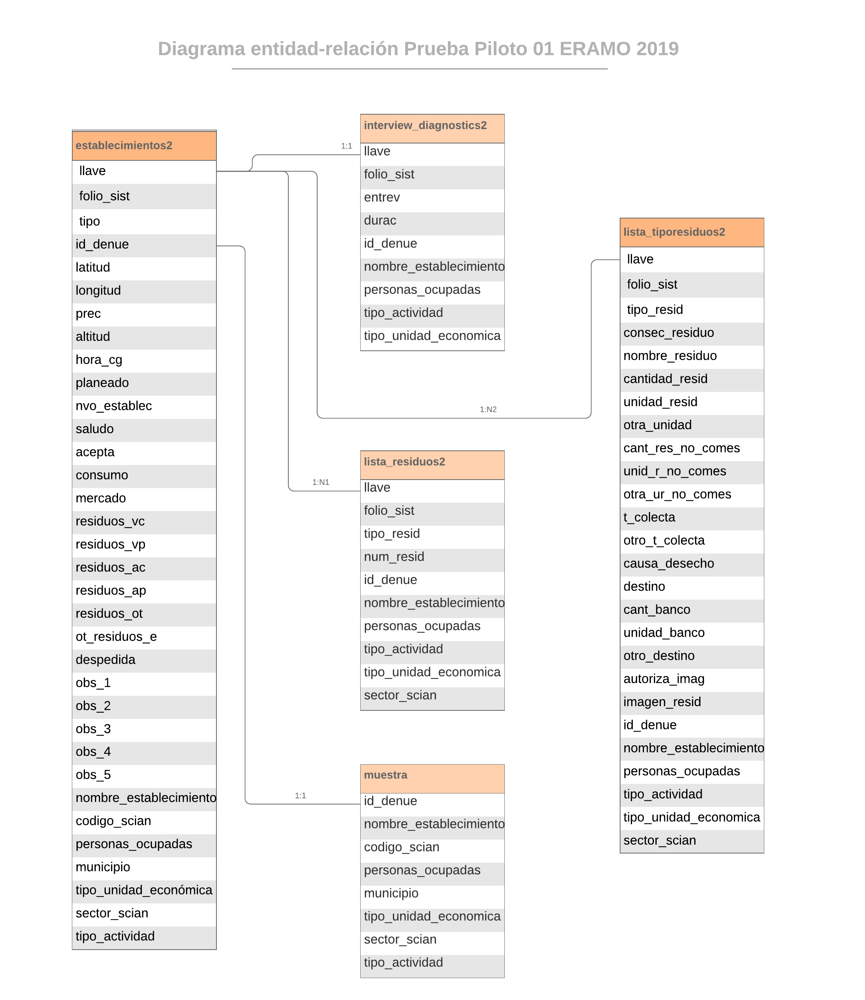

```{r setup, include=FALSE}
knitr::opts_chunk$set(echo = TRUE)
```

# 3.3 Procesamiento de la información.

Este proceso comprende todos los pasos necesarios que deben seguirse para tratar los datos captados en campo (Base de datos de salida), a fin de depurar y eliminar cualquier inconsistencia en los mismos, de tal modo que pueda generarse una versión de la base de datos que pueda ser explotada con confianza.

## 3.3.1 Validación en línea del cuestionario.

Una de las grandes ventajas que proporcionó el uso de la plataforma del cuestionario electrónico, fue la posibilidad de insertar dentro del instrumento de captación, validaciones básicas que aseguran la calidad de los datos desde la salida misma de captura. Específicamente, comprenden al menos 3 tipos de validaciones:

1) De secuencia lógica del cuestionario. Corresponden a las validaciones referentes al flujo de las preguntas, y comprenden los filtros y pases entre preguntas y secciones. La aplicación garantiza que al programarse dichos elementos, no pueda cerrarse la entrevista si existen errores de este tipo, por lo que el entrevistador puede corregir de inmediato cualquier situación indeseable al respecto.

2) Rangos válidos. El cuestionario electrónico garantiza que una variable no podrá contener un rango distinto de valores para lo que se programa. Esto excluye también la posibilidad de captar caracteres o tipos de datos ajenos a lo que se espera.

3) Validaciones especiales. El diseñador del cuestionario puede incluir validaciones adicionales relacionadas con aspectos lógicos o conceptuales de interrelación entre dos o más preguntas del cuestionario. Específicamente, para esta encuesta se construyeron validaciones para hacer consistentes las unidades de medida de los residuos declarados entre sí, de modo que si alguien declara una cantidad de residuos total, al momento de desglosar de ellos la cantidad no comestible, esta última no resulte mayor que la primera. También se verifica que si alguien declaró por ejemplo unidades en litros en una pregunta, no pueda declarar toneladas en otra, por ejemplo. Las expresiones para las condiciones de validación fueron las siguientes:

<br>

```{r i_3_3_1, fig.align='center', out.width= '95%', echo=FALSE, cache=TRUE}

knitr::include_graphics("validacion.png")

```


<br>
<br>

## 3.3.2 Bitácora de procesamiento.

El conjunto de procedimientos aplicados a la BD de salida para llegar hasta la construcción de la BD para explotación, puede encontrarse en el documento que se muestra a continuación, denominado *Bitácora de Procesamiento*.

<br>

<iframe src="bitacora.pdf" style="width:100%; height:650px;" frameborder="0"></iframe>

<br>
<br>


## 3.3.3 Base de datos liberada

### 3.3.3.1 Contenido de la Base de Datos

<br>

La base de datos liberada para explotación, presenta la siguiente estructura:

<br>

| **Tabla** |  **Contenido** | **Registros** | **Campos** |
|:----------------------|:----------------------|----------------------:|----------------------:|
| establecimientos2.csv | Datos generales de los establecimientos y tipo de residuos que generan | 120 | 34 |
| lista_residuos2.csv | Tipo y número de residuos declarados en los establecimientos | 152 | 10 |
| lista_tiporesiduos2.csv | Residuos de los establecimientos y su caracterización  | 191 | 26 |
| interview_diagnostics2.csv | Tiempos de entrevista  | 119 | 9 |
| muestra.csv | Listado de unidades económicas que conformaron la muestra original | 106 | 8 |

<br>
<br>

### 3.3.3.2 Diagrama Entidad-Relación

<br>

El modelo de interrelaciones de la base de datos liberada para explotación queda de acuerdo a lo siguiente:


```{r i_3_3_3_2, fig.align='center', out.width= '100%', echo=FALSE, cache=TRUE}



```


## 3.3.4 Frecuencias por pregunta

A continuación se muestran las frecuencias obtenidas para cada variable de la base de datos

<br>
<br>

## 3.3.5 Postprocesos

### 3.3.5.1 Cálculo de variables auxiliares.

A fin de explotar adecuadamente ciertas variables, es necesario con frecuencia, calcular variables auxiliares partir de las que aparecen en la base de datos. 

En el caso específico de nuestra BD, hubo que construir 3 variables auxiliares:

1. Tiempo de duración de la entrevista en minutos. Debido a que el formato de esta variable que arroja el sistema de captura es el estándar para variables de tiempo (dd.hh:mm:ss). 

2. Cantidad de residuos (sólidos) semanales en kg. Dado que la captación de residuos involucró varias unidades posibles (*gramos, kilogramos, toneladas, litros, otra unidad*), así como diversos tiempos o periodos de recolección de los mismos (*diario, semanal, quincenal, mensual, otro periodo*), se tuvo que calcular, siempre que fuera posible la cantidad de residuos semanales de cada residuo declarado. El algoritmo de cálculo es simple y consiste simplemente en homogenizar las unidades de masa y de tiempo a kg/semana. En este cálculo se excluye a los establecimientos que declaran sus residuos en litros, cuya frecuencia en la muestra fue muy baja, así como a quienes declaran otra unidad de medida y en su especificación, ésta resulta del tipo "botes", "cubetas", "bolsas", y otras similares, que representan una desafío adicional para la medición. Algo similar sucede en el caso de la declaración de la categoría *Otro* de la pregunta *2.4f Periodo en el que reúne esos residuos*, ya que las respuestas pueden variar desde "*cada tercer día*" hasta "*esporádico*" o "*eventalmente*". Se deben, por tanto, diseñar estrategias para el tratamiento de este tipo de información con miras al siguiente levantamiento.

3. Cantidad de residuos no comestibles (sólidos) semanales en kg. Es el mismo caso de la variable anterior, sólo que usando los residuos no comestibles. Dado que las unidades de medida y de temporalidad de residuos se captaron de la misma forma, la variable calculada se trata de la misma forma y presenta los mismos problemas que la anterior.


### 3.3.5.2 Codificación.

Se tiene previsto un proceso de codificación de las variables abiertas del cuestionario. De este modo, se pretenden construir categorías que puedan ser de utilidad para la siguiente prueba piloto. Esto requiere un fuerte trabajo de análisis conceptual, que de ser posible se refuerce a través de la consulta bibliográfica y se apoye en el marco teórico del proyecto. Sería deseable también que actores externos involucrados en la materia contribuyeran a mejorar el instrumento de captación en estos aspectos.


# 3.4. Resultados

## 3.4.1 Consideración inicial acerca de las cifras que se obtienen de la muestra

Antes de dar paso al análisis de los datos captados en el operativo de prueba, es necesario recordar al lector que se debe tener presente que la muestra no fue construida en forma probabilística, de tal forma que no pueden obtenerse inferencias y ni siquiera pueden usarse las cifras obtenidas como indicadores de estimaciones o aproximaciones a los datos poblacionales. Todas las cifras que a continuación se presentan, deben ser tomadas con precaución, pues están lejos de constituir indicadores. Se analizan únicamente con el fin de mostrar ciertas tendencias o anticipar cierto tipo de respuestas a las preguntas realizadas.

Por esta razón, tampoco se construyeron tabulados, y los indicadores obtenidos como las medias o medianas, sin duda están sesgadas. Por lo tanto, una lectura literal de las mismas, podría resultar engañosa o perjudicial para el análisis que se desarrolla.

Una consideración adicional consiste en recordar que el tamaño de la muestra es muy pequeño como para intentar concluir acerca de los estadísticos que se mostrarán. Se debe entender que el objetivo primordial de esta prueba piloto he sido el de arrojar luz sobre la información que puede ser obtenida mediante una encuesta de este tipo, y de la cual no existen antecentes en el país. 

<br>


## 3.4.2 Cifras Globales

Se visitaron 138 establecimientos, de los cuales en 120 se pudo obtener entrevista (87%). En 10 casos no fue posible obtener entrevista porque los establecimientos estaban cerrados, cambiaron de domicilio o se encontró un establecimiento que no tiene que ver ya con los alimentos (7.2%), el número de negocios que se negaron a proporcionar información fue de 6 (4.3%) y en 2 casos (1.4%) nos remitieron a las oficinas regionales para que nos proporcionaran información de su empresa.

De los 120 establecimientos con entrevista válida, 89 son de carácter fijo o semifijo, y 31 unidades económicas situadas en la calle.

El siguiente mapa muestra la ubicación de los establecimientos

<br>


## 3.4.3 Generación de residuos por tipo


De acuerdo con los datos obtenidos de la muestra, en la unidades de observación definidas para esta prueba, el tipo de residuos que se reporta principalmente son los de *Vegetal Crudo*, le siguen los de *Animal Crudo*, enseguida los de *otro tipo*, que se refiere en la mayoría de los casos a los alimentos preparados, en el que se sirven mezclados los vegetales y la carne. 


```{r t_res, echo = FALSE, message = FALSE, fig.height= 6, fig.width= 8, warning = FALSE, cache=F}

library(ggplot2)
establecimientos2 <- read.csv("bd_explot/establecimientos2.csv")
barplot(c(sum(establecimientos2$residuos_vc,na.rm = T),
          sum(establecimientos2$residuos_vp,na.rm = T),
          sum(establecimientos2$residuos_ac,na.rm = T),  
          sum(establecimientos2$residuos_ap,na.rm = T),
          sum(establecimientos2$residuos_ot,na.rm = T)), 
        beside=T, 
        main='Frecuencia de tipos de residuos declarados',
        legend.text= c('Vegetal crudo','Vegetal procesado', 'Animal crudo',
                       'Animal procesado', 'Otro tipo'),
        args.legend = list(x = "topright", bty="n", ncol = 2),
        ylab='Frecuencia', 
        ylim= c(0,80),
                col=c('deepskyblue2','deepskyblue4','orange3','orange4','darkolivegreen4'))

```
<p align="center"> **Fuente: INEGI. Prueba Piloto 01 ERAMO 2019** </p>

<br>
<br>

Una vez que el informante declaraba el tipo de residuo según las categorías anteriores, se le solicitó que describiera en qué consistían dichos residuos. El análisis de esta información puede realizarse mediante una herramienta de minería de textos en R, obteniendo las siguientes frecuencias por tipo de residuo declarado.

<br>

<p align="center"> **Frecuencia de palabras declaradas en la pregunta _2.4a ¿Cuál es el nombre del residuo que reporta?_, por tipo de residuo** </p>
```{r tab100, echo=FALSE, fig.align='left', warning=FALSE}

library(DT)
tab100 <- read.csv("bd_explot/descrip_residuos_texto.csv", header=T)
tab100 <- tab100[,-1]
names(tab100) <- c("Vegetal crudo (palabra declarada)","Frecuencia","Vegetal procesado (palabra declarada)","Frecuencia","Animal crudo (palabra declarada)","Frecuencia","Animal procesado (palabra declarada)","Frecuencia")
DT::datatable(tab100,filter = 'top', options = list(
  pageLength = 5, autoWidth = TRUE, scrollX = TRUE,
  fixedColumns = TRUE, language = list(
    info = "Mostrando registros del _START_ al _END_ de un total de _TOTAL_ registros",
    paginate = list(previous = 'Anterior', `next` = 'Siguiente'),
    search =  "Buscar:", lengthMenu = "Mostrar _MENU_ registros" )
  ))

```


<br>
<br>

La categoría adicional de tipo de residuos denominada "*Otro tipo*", se captó en forma abierta. Los resultados del texto capturado son:

<br>

<p align="center"> **Frecuencia de palabras declaradas en la pregunta _2.3a Otro tipo de residuo_** </p>

```{r tab100a, echo=FALSE, fig.align='left', warning=FALSE}

library(DT)
tab100a <- read.csv("bd_explot/otros_residuos_texto.csv", header=T)

DT::datatable(tab100a,filter = 'top', options = list(
  pageLength = 5, autoWidth = TRUE, scrollX = TRUE,
  fixedColumns = TRUE, language = list(
    info = "Mostrando registros del _START_ al _END_ de un total de _TOTAL_ registros",
    paginate = list(previous = 'Anterior', `next` = 'Siguiente'),
    search =  "Buscar:", lengthMenu = "Mostrar _MENU_ registros" )
  ))

```

<br>

Del análisis de las dos preguntas anteriores, pueden obtenerse elementos para construir categorías de respuesta precodificadas para la captación de los residuos de forma más específica.

## 3.4.4 Caso especial: *La Huerta*

En este punto del análisis, es necesario hacer mención especial de la empresa cultivadora y procesadora de verduras y frutas congeladas "*La Huerta*", la cual proporcionó información muy precisa sobre los residuos que genera. La importancia de este tipo de unidades económicas es que por sí mismas constituyen un subuniverso de estudio de grán interés para el proyecto. de este modo, por el hecho de que los valores de residuos declarados en dicho establecimiento se encuentran muy por encima del promedio del resto de las unidades económicas (el orden de magnitud de sus residuos es de miles de toneladas anuales, y en el caso de las cosechas no levantadas, mensuales), sus datos no deben ser considerados junto al resto de establecimientos, ya que su comportamiento atípico sesga demasiado los estadísticos de la muestra.

Los datos captados en dicho establecimiento fueron los siguientes.


<p align="center"> **Datos captados sobre residuos generados por _La Huerta_** </p>

```{r tab101, echo=FALSE, message=FALSE}

library(kableExtra)
tab101 <- read.csv("bd_explot/huerta.csv", header=T)
names(tab101) <- c( "Tipo de residuo", "Contenido del residuo", "Cantidad", "Unidad", "Cantidad del residuo que es no comestible", "Unidad de Resid No Comest","Periodo", "Causa del desecho", "Destino")
kableExtra::kable(tab101, align = c('l','l','l','l','l','l','l','l')) %>%
  kableExtra::kable_styling(bootstrap_options = c("striped", "hover"))

``` 

<br>

En virtud de lo anterior, se excluye en lo sucesivo para todos los cálculos sobre cantidades de residuos, la información proporcionada por dicha empresa.

<br>

## 3.4.5 Promedio de residuos generados

Aún cuando no se consideren los datos de "La Huerta", se encuentra que prevalece mucha dispersión en la información restante sobre cantidades de residuos. Los promedios que se obtienen reflejan esta situación.

<br>

<p align="center"> **Promedio semanal de residuos declarados en las unidades de la muestra** </p>

| **Residuo** |  **Promedio (kg/semana)** | **Mediana (kg/semana)** |
|----------------------|----------------------|----------------------|
| Residuos (sólidos) totales | 80.1 | 28 |
| Residuos (sólidos) no comestibles | 68.3 | 28 |

<br>
<br>

Las gráficas de las cantidades declaradas ilustran respecto a la dispersión de los datos, y la existencia de varios puntos atípicos que sesgan el promedio.


```{r graf_r_sem, echo = FALSE, message = FALSE, fig.height= 5, fig.width= 12, warning = FALSE, cache=F}

lista_tiporesiduos2 <- read.csv("bd_explot/lista_tiporesiduos2.csv")

lista_tiporesiduos2$kilos <- rep(0,191)
lista_tiporesiduos2$kilos[which(lista_tiporesiduos2$unidad_resid==1)] <- lista_tiporesiduos2$cantidad_resid[which(lista_tiporesiduos2$unidad_resid==1)]/1000
lista_tiporesiduos2$kilos[which(lista_tiporesiduos2$unidad_resid==2)] <- lista_tiporesiduos2$cantidad_resid[which(lista_tiporesiduos2$unidad_resid==2)]
lista_tiporesiduos2$kilos[which(lista_tiporesiduos2$unidad_resid==3)] <- lista_tiporesiduos2$cantidad_resid[which(lista_tiporesiduos2$unidad_resid==3)]*1000

lista_tiporesiduos2$kilos_sem <- rep(0,191)
lista_tiporesiduos2$kilos_sem[which(lista_tiporesiduos2$t_colecta==1)] <- lista_tiporesiduos2$kilos[which(lista_tiporesiduos2$t_colecta==1)]*7
lista_tiporesiduos2$kilos_sem[which(lista_tiporesiduos2$t_colecta==2)] <- lista_tiporesiduos2$kilos[which(lista_tiporesiduos2$t_colecta==2)]
lista_tiporesiduos2$kilos_sem[which(lista_tiporesiduos2$t_colecta==3)] <- lista_tiporesiduos2$kilos[which(lista_tiporesiduos2$t_colecta==3)]/2
lista_tiporesiduos2$kilos_sem[which(lista_tiporesiduos2$t_colecta==4)] <- lista_tiporesiduos2$kilos[which(lista_tiporesiduos2$t_colecta==4)]/4
lista_tiporesiduos2$kilos_sem[which(lista_tiporesiduos2$t_colecta==5 & lista_tiporesiduos2$otro_t_colecta == "anual")] <- lista_tiporesiduos2$kilos[which(lista_tiporesiduos2$t_colecta==5 & lista_tiporesiduos2$otro_t_colecta == "anual")]/52

lista_tiporesiduos2$kilos_nc <- rep(0,191)
lista_tiporesiduos2$kilos_nc[which(lista_tiporesiduos2$unid_r_no_comes==1)] <- lista_tiporesiduos2$cant_res_no_comes[which(lista_tiporesiduos2$unid_r_no_comes==1)]/1000
lista_tiporesiduos2$kilos_nc[which(lista_tiporesiduos2$unid_r_no_comes==2)] <- lista_tiporesiduos2$cant_res_no_comes[which(lista_tiporesiduos2$unid_r_no_comes==2)]
lista_tiporesiduos2$kilos_nc[which(lista_tiporesiduos2$unid_r_no_comes==3)] <- lista_tiporesiduos2$cant_res_no_comes[which(lista_tiporesiduos2$unid_r_no_comes==3)]*1000

lista_tiporesiduos2$kilos_sem_nc <- rep(0,191)
lista_tiporesiduos2$kilos_sem_nc[which(lista_tiporesiduos2$t_colecta==1)] <- lista_tiporesiduos2$kilos_nc[which(lista_tiporesiduos2$t_colecta==1)]*7
lista_tiporesiduos2$kilos_sem_nc[which(lista_tiporesiduos2$t_colecta==2)] <- lista_tiporesiduos2$kilos_nc[which(lista_tiporesiduos2$t_colecta==2)]
lista_tiporesiduos2$kilos_sem_nc[which(lista_tiporesiduos2$t_colecta==3)] <- lista_tiporesiduos2$kilos_nc[which(lista_tiporesiduos2$t_colecta==3)]/2
lista_tiporesiduos2$kilos_sem_nc[which(lista_tiporesiduos2$t_colecta==4)] <- lista_tiporesiduos2$kilos_nc[which(lista_tiporesiduos2$t_colecta==4)]/4
lista_tiporesiduos2$kilos_sem_nc[which(lista_tiporesiduos2$t_colecta==5 & lista_tiporesiduos2$otro_t_colecta == "anual")] <- lista_tiporesiduos2$kilos_nc[which(lista_tiporesiduos2$t_colecta==5 & lista_tiporesiduos2$otro_t_colecta == "anual")]/52

par(mfrow=c(1,2))

plot(sort(lista_tiporesiduos2$kilos_sem[which(lista_tiporesiduos2$kilos_sem > 0 & 
                                                lista_tiporesiduos2$nombre_establecimiento != "LA HUERTA")]), 
     col="darkgreen", pch=17, 
     main = "Residuos semanales declarados", xlab = "", ylab="kg")

plot(sort(lista_tiporesiduos2$kilos_sem_nc[which(lista_tiporesiduos2$kilos_sem_nc > 0 & 
                                                lista_tiporesiduos2$nombre_establecimiento != "LA HUERTA")]), 
     col="red", pch=17, 
     main = "Residuos semanales no comestibles declarados", xlab = "", ylab="kg")
```
<p align="center"> **Fuente: INEGI. Prueba Piloto 01 ERAMO 2019** </p>


<br>

En este caso particular, **es mejor emplear la mediana como medida de tendencia central**, ya que no es un estadístico tan susceptible al sesgo por puntos atípicos.

<br>

## 3.4.6 Cantidades de residuos declarados por tipo de residuo y establecimiento

Cuando se extiende el análisis anterior al desglose por tipo de residuo declarado, las distribuciones de cantidades se muestran como sigue:

```{r graf_r_sem_tipos, echo = FALSE, message = FALSE, fig.height= 8, fig.width= 10, warning = FALSE, cache=F}

lista_tiporesiduos2 <- read.csv("bd_explot/lista_tiporesiduos2.csv")

lista_tiporesiduos2$kilos <- rep(0,191)
lista_tiporesiduos2$kilos[which(lista_tiporesiduos2$unidad_resid==1)] <- lista_tiporesiduos2$cantidad_resid[which(lista_tiporesiduos2$unidad_resid==1)]/1000
lista_tiporesiduos2$kilos[which(lista_tiporesiduos2$unidad_resid==2)] <- lista_tiporesiduos2$cantidad_resid[which(lista_tiporesiduos2$unidad_resid==2)]
lista_tiporesiduos2$kilos[which(lista_tiporesiduos2$unidad_resid==3)] <- lista_tiporesiduos2$cantidad_resid[which(lista_tiporesiduos2$unidad_resid==3)]*1000

lista_tiporesiduos2$kilos_sem <- rep(0,191)
lista_tiporesiduos2$kilos_sem[which(lista_tiporesiduos2$t_colecta==1)] <- lista_tiporesiduos2$kilos[which(lista_tiporesiduos2$t_colecta==1)]*7
lista_tiporesiduos2$kilos_sem[which(lista_tiporesiduos2$t_colecta==2)] <- lista_tiporesiduos2$kilos[which(lista_tiporesiduos2$t_colecta==2)]
lista_tiporesiduos2$kilos_sem[which(lista_tiporesiduos2$t_colecta==3)] <- lista_tiporesiduos2$kilos[which(lista_tiporesiduos2$t_colecta==3)]/2
lista_tiporesiduos2$kilos_sem[which(lista_tiporesiduos2$t_colecta==4)] <- lista_tiporesiduos2$kilos[which(lista_tiporesiduos2$t_colecta==4)]/4
lista_tiporesiduos2$kilos_sem[which(lista_tiporesiduos2$t_colecta==5 & lista_tiporesiduos2$otro_t_colecta == "anual")] <- lista_tiporesiduos2$kilos[which(lista_tiporesiduos2$t_colecta==5 & lista_tiporesiduos2$otro_t_colecta == "anual")]/52

lista_tiporesiduos2$kilos_nc <- rep(0,191)
lista_tiporesiduos2$kilos_nc[which(lista_tiporesiduos2$unid_r_no_comes==1)] <- lista_tiporesiduos2$cant_res_no_comes[which(lista_tiporesiduos2$unid_r_no_comes==1)]/1000
lista_tiporesiduos2$kilos_nc[which(lista_tiporesiduos2$unid_r_no_comes==2)] <- lista_tiporesiduos2$cant_res_no_comes[which(lista_tiporesiduos2$unid_r_no_comes==2)]
lista_tiporesiduos2$kilos_nc[which(lista_tiporesiduos2$unid_r_no_comes==3)] <- lista_tiporesiduos2$cant_res_no_comes[which(lista_tiporesiduos2$unid_r_no_comes==3)]*1000

lista_tiporesiduos2$kilos_sem_nc <- rep(0,191)
lista_tiporesiduos2$kilos_sem_nc[which(lista_tiporesiduos2$t_colecta==1)] <- lista_tiporesiduos2$kilos_nc[which(lista_tiporesiduos2$t_colecta==1)]*7
lista_tiporesiduos2$kilos_sem_nc[which(lista_tiporesiduos2$t_colecta==2)] <- lista_tiporesiduos2$kilos_nc[which(lista_tiporesiduos2$t_colecta==2)]
lista_tiporesiduos2$kilos_sem_nc[which(lista_tiporesiduos2$t_colecta==3)] <- lista_tiporesiduos2$kilos_nc[which(lista_tiporesiduos2$t_colecta==3)]/2
lista_tiporesiduos2$kilos_sem_nc[which(lista_tiporesiduos2$t_colecta==4)] <- lista_tiporesiduos2$kilos_nc[which(lista_tiporesiduos2$t_colecta==4)]/4
lista_tiporesiduos2$kilos_sem_nc[which(lista_tiporesiduos2$t_colecta==5 & lista_tiporesiduos2$otro_t_colecta == "anual")] <- lista_tiporesiduos2$kilos_nc[which(lista_tiporesiduos2$t_colecta==5 & lista_tiporesiduos2$otro_t_colecta == "anual")]/52

par(mfrow=c(2,2))

plot(sort(lista_tiporesiduos2$kilos_sem[which(lista_tiporesiduos2$kilos_sem > 0 & 
                                                lista_tiporesiduos2$nombre_establecimiento != "LA HUERTA" &
                                                lista_tiporesiduos2$tipo_resid == 1)]), 
     col="deepskyblue2", pch=17,
     main = "Residuos semanales de vegetal crudo", xlab = "", ylab="kg")

plot(sort(lista_tiporesiduos2$kilos_sem[which(lista_tiporesiduos2$kilos_sem > 0 & 
                                                lista_tiporesiduos2$nombre_establecimiento != "LA HUERTA" &
                                                lista_tiporesiduos2$tipo_resid == 2)]), 
     col="deepskyblue4", pch=17,
     main = "Residuos semanales de vegetal procesado", xlab = "", ylab="kg")


plot(sort(lista_tiporesiduos2$kilos_sem[which(lista_tiporesiduos2$kilos_sem > 0 & 
                                                lista_tiporesiduos2$nombre_establecimiento != "LA HUERTA" &
                                                lista_tiporesiduos2$tipo_resid == 3)]), 
     col="orange3", pch=17,
     main = "Residuos semanales de animal crudo", xlab = "", ylab="kg")

plot(sort(lista_tiporesiduos2$kilos_sem[which(lista_tiporesiduos2$kilos_sem > 0 & 
                                                lista_tiporesiduos2$nombre_establecimiento != "LA HUERTA" &
                                                lista_tiporesiduos2$tipo_resid == 4)]), 
     col="orange4", pch=17,
     main = "Residuos semanales de animal procesado", xlab = "", ylab="kg")

```
<p align="center"> **Fuente: INEGI. Prueba Piloto 01 ERAMO 2019** </p>

<br>

De forma similar al promedio total, los promedios por tipo de residuo muestran comportamientos sesgados hacia arriba:

<p align="center"> **Promedios y medianas de residuos semanales declarados, por tipo de residuo** </p>
```{r tab102, echo=FALSE, message=FALSE}

library(kableExtra)
tab102 <- read.csv("bd_explot/promedios.csv", header=T)
names(tab102) <- c( "Tipo de residuo","Promedio (kg/semanales)","Mediana (kg/semanales)")
kableExtra::kable(tab102, align = c('l','r','r')) %>%
  kableExtra::kable_styling(bootstrap_options = c("striped", "hover"))

``` 

Las medianas, en todos los casos, parecen ser los mejores estadisticos de tendencia central, para esta variable.

<br>
<br>

Un análisis más a fondo de los tipos de residuos requiere observar su comportamiento por tamaño del establecimiento. La siguiente gráfica nos muestra dicho comportamiento. En particular, no parece haber mucha difecrencia entre la cantidad de residuos declarados en función del tamaño del establecimiento (el valor por encima de la tendencia general en el caso de la categoría *31 a 50 personas*, corresponde a un solo punto, por lo que no puede ser tomado como tendencia).

<br>

```{r graf_r_tam, echo = FALSE, message = FALSE, fig.height= 8, fig.width= 10, warning = FALSE, cache=F}
library(ggplot2)  

lista_tiporesiduos2 <- read.csv("bd_explot/lista_tiporesiduos2.csv")

lista_tiporesiduos2$kilos <- rep(0,191)
lista_tiporesiduos2$kilos[which(lista_tiporesiduos2$unidad_resid==1)] <- lista_tiporesiduos2$cantidad_resid[which(lista_tiporesiduos2$unidad_resid==1)]/1000
lista_tiporesiduos2$kilos[which(lista_tiporesiduos2$unidad_resid==2)] <- lista_tiporesiduos2$cantidad_resid[which(lista_tiporesiduos2$unidad_resid==2)]
lista_tiporesiduos2$kilos[which(lista_tiporesiduos2$unidad_resid==3)] <- lista_tiporesiduos2$cantidad_resid[which(lista_tiporesiduos2$unidad_resid==3)]*1000

lista_tiporesiduos2$kilos_sem <- rep(0,191)
lista_tiporesiduos2$kilos_sem[which(lista_tiporesiduos2$t_colecta==1)] <- lista_tiporesiduos2$kilos[which(lista_tiporesiduos2$t_colecta==1)]*7
lista_tiporesiduos2$kilos_sem[which(lista_tiporesiduos2$t_colecta==2)] <- lista_tiporesiduos2$kilos[which(lista_tiporesiduos2$t_colecta==2)]
lista_tiporesiduos2$kilos_sem[which(lista_tiporesiduos2$t_colecta==3)] <- lista_tiporesiduos2$kilos[which(lista_tiporesiduos2$t_colecta==3)]/2
lista_tiporesiduos2$kilos_sem[which(lista_tiporesiduos2$t_colecta==4)] <- lista_tiporesiduos2$kilos[which(lista_tiporesiduos2$t_colecta==4)]/4
lista_tiporesiduos2$kilos_sem[which(lista_tiporesiduos2$t_colecta==5 & lista_tiporesiduos2$otro_t_colecta == "anual")] <- lista_tiporesiduos2$kilos[which(lista_tiporesiduos2$t_colecta==5 & lista_tiporesiduos2$otro_t_colecta == "anual")]/52

levels(lista_tiporesiduos2$personas_ocupadas) <- c("0 a 5 pers", "6 a 10 pers", "11 a 30 pers", "31 a 50 pers", 
                                                   "51 a 100 pers", "101 a 250 pers", "251 y más pers")                    

ggplot(lista_tiporesiduos2[which(lista_tiporesiduos2$kilos_sem > 0 & 
                                   lista_tiporesiduos2$nombre_establecimiento != "LA HUERTA"),], 
       aes(x=lista_tiporesiduos2$personas_ocupadas[which(lista_tiporesiduos2$kilos_sem > 0 & 
                                         lista_tiporesiduos2$nombre_establecimiento != "LA HUERTA")], 
           y=lista_tiporesiduos2$kilos_sem[which(lista_tiporesiduos2$kilos_sem > 0 & 
                                                   lista_tiporesiduos2$nombre_establecimiento != "LA HUERTA")])) + 
  geom_boxplot(
    # custom boxes
    color="dodgerblue4",
    fill="dodgerblue4",
    alpha=0.2,
    # Notch
    notch=F,
    notchwidth = 0.8,
    # custom outliers
    outlier.colour="navy",
    outlier.fill="navy",
    outlier.size=3) +
  xlab('Personas Ocupadas') + ylab('kg') + 
  ggtitle('Residuos semanales por tamaño del establecimiento')


``` 
<br>

<p align="center"> **Fuente: INEGI. Prueba Piloto 01 ERAMO 2019** </p>

<br>
<br>

En el caso de la cantidad de residuos semanales por tipo de unidad económica, sí parece haber algunas tendencias. 

<br>

```{r graf_r_tipouni, echo = FALSE, message = FALSE, fig.height= 12, fig.width= 10, warning = FALSE, cache=F}
library(ggplot2)  

lista_tiporesiduos2 <- read.csv("bd_explot/lista_tiporesiduos2.csv")

lista_tiporesiduos2$kilos <- rep(0,191)
lista_tiporesiduos2$kilos[which(lista_tiporesiduos2$unidad_resid==1)] <- lista_tiporesiduos2$cantidad_resid[which(lista_tiporesiduos2$unidad_resid==1)]/1000
lista_tiporesiduos2$kilos[which(lista_tiporesiduos2$unidad_resid==2)] <- lista_tiporesiduos2$cantidad_resid[which(lista_tiporesiduos2$unidad_resid==2)]
lista_tiporesiduos2$kilos[which(lista_tiporesiduos2$unidad_resid==3)] <- lista_tiporesiduos2$cantidad_resid[which(lista_tiporesiduos2$unidad_resid==3)]*1000

lista_tiporesiduos2$kilos_sem <- rep(0,191)
lista_tiporesiduos2$kilos_sem[which(lista_tiporesiduos2$t_colecta==1)] <- lista_tiporesiduos2$kilos[which(lista_tiporesiduos2$t_colecta==1)]*7
lista_tiporesiduos2$kilos_sem[which(lista_tiporesiduos2$t_colecta==2)] <- lista_tiporesiduos2$kilos[which(lista_tiporesiduos2$t_colecta==2)]
lista_tiporesiduos2$kilos_sem[which(lista_tiporesiduos2$t_colecta==3)] <- lista_tiporesiduos2$kilos[which(lista_tiporesiduos2$t_colecta==3)]/2
lista_tiporesiduos2$kilos_sem[which(lista_tiporesiduos2$t_colecta==4)] <- lista_tiporesiduos2$kilos[which(lista_tiporesiduos2$t_colecta==4)]/4
lista_tiporesiduos2$kilos_sem[which(lista_tiporesiduos2$t_colecta==5 & lista_tiporesiduos2$otro_t_colecta == "anual")] <- lista_tiporesiduos2$kilos[which(lista_tiporesiduos2$t_colecta==5 & lista_tiporesiduos2$otro_t_colecta == "anual")]/52

ggplot(lista_tiporesiduos2[which(lista_tiporesiduos2$kilos_sem > 0 & 
                                   lista_tiporesiduos2$nombre_establecimiento != "LA HUERTA" &
                                   lista_tiporesiduos2$tipo_actividad != ''),], 
       aes(x=lista_tiporesiduos2$tipo_actividad[which(lista_tiporesiduos2$kilos_sem > 0 & 
                                                           lista_tiporesiduos2$nombre_establecimiento != "LA HUERTA"&
                                                           lista_tiporesiduos2$tipo_actividad != '')], 
           y=lista_tiporesiduos2$kilos_sem[which(lista_tiporesiduos2$kilos_sem > 0 & 
                                                   lista_tiporesiduos2$nombre_establecimiento != "LA HUERTA"&
                                                   lista_tiporesiduos2$tipo_actividad != '')])) + 
  geom_boxplot(
    # custom boxes
    color="dodgerblue4",
    fill="dodgerblue4",
    alpha=0.2,
    # Notch
    notch=F,
    notchwidth = 0.8,
    # custom outliers
    outlier.colour="navy",
    outlier.fill="navy",
    outlier.size=3) +
  xlab('') + ylab('kg') + 
  ggtitle('Residuos semanales por tipo de actividad') +
  theme(axis.text.x = element_text(angle = 90, hjust = 1))

``` 
<p align="center"> **Fuente: INEGI. Prueba Piloto 01 ERAMO 2019** </p>


En particular, destacan los comercios al por mayor de carnes y verduras, así como los comercios de alimentos en supermercados. Llama la atención también la dispersión de cantidades declaradas en el ramo de restaurantes.

<br>
<br>

Finalmente, al comparar las cantidades de residuos por sector de actividad económica, parece haber una clara tendencia a una mayor generación de residuos para los establecimientos del sector primario (téngase en cuenta el caso de "*La Huerta*", cuya producción de residuos es mucho mayor que las que aquí se muestran).

<br>


```{r graf_r_sector, echo = FALSE, message = FALSE, fig.height= 8, fig.width= 10, warning = FALSE, cache=F}

library(ggplot2)  

lista_tiporesiduos2 <- read.csv("bd_explot/lista_tiporesiduos2.csv")

lista_tiporesiduos2$kilos <- rep(0,191)
lista_tiporesiduos2$kilos[which(lista_tiporesiduos2$unidad_resid==1)] <- lista_tiporesiduos2$cantidad_resid[which(lista_tiporesiduos2$unidad_resid==1)]/1000
lista_tiporesiduos2$kilos[which(lista_tiporesiduos2$unidad_resid==2)] <- lista_tiporesiduos2$cantidad_resid[which(lista_tiporesiduos2$unidad_resid==2)]
lista_tiporesiduos2$kilos[which(lista_tiporesiduos2$unidad_resid==3)] <- lista_tiporesiduos2$cantidad_resid[which(lista_tiporesiduos2$unidad_resid==3)]*1000

lista_tiporesiduos2$kilos_sem <- rep(0,191)
lista_tiporesiduos2$kilos_sem[which(lista_tiporesiduos2$t_colecta==1)] <- lista_tiporesiduos2$kilos[which(lista_tiporesiduos2$t_colecta==1)]*7
lista_tiporesiduos2$kilos_sem[which(lista_tiporesiduos2$t_colecta==2)] <- lista_tiporesiduos2$kilos[which(lista_tiporesiduos2$t_colecta==2)]
lista_tiporesiduos2$kilos_sem[which(lista_tiporesiduos2$t_colecta==3)] <- lista_tiporesiduos2$kilos[which(lista_tiporesiduos2$t_colecta==3)]/2
lista_tiporesiduos2$kilos_sem[which(lista_tiporesiduos2$t_colecta==4)] <- lista_tiporesiduos2$kilos[which(lista_tiporesiduos2$t_colecta==4)]/4
lista_tiporesiduos2$kilos_sem[which(lista_tiporesiduos2$t_colecta==5 & lista_tiporesiduos2$otro_t_colecta == "anual")] <- lista_tiporesiduos2$kilos[which(lista_tiporesiduos2$t_colecta==5 & lista_tiporesiduos2$otro_t_colecta == "anual")]/52

ggplot(lista_tiporesiduos2[which(lista_tiporesiduos2$kilos_sem > 0 & 
                                   lista_tiporesiduos2$nombre_establecimiento != "LA HUERTA"),], 
       aes(x=lista_tiporesiduos2$sector_scian[which(lista_tiporesiduos2$kilos_sem > 0 & 
                                                        lista_tiporesiduos2$nombre_establecimiento != "LA HUERTA")], 
           y=lista_tiporesiduos2$kilos_sem[which(lista_tiporesiduos2$kilos_sem > 0 & 
                                                   lista_tiporesiduos2$nombre_establecimiento != "LA HUERTA")])) + 
  geom_boxplot(
    # custom boxes
    color="dodgerblue4",
    fill="dodgerblue4",
    alpha=0.2,
    # Notch
    notch=F,
    notchwidth = 0.8,
    # custom outliers
    outlier.colour="navy",
    outlier.fill="navy",
    outlier.size=3) +
  xlab('') + ylab('kg') + 
  ggtitle('Residuos semanales por sector de actividad') 
```
<p align="center"> **Fuente: INEGI. Prueba Piloto 01 ERAMO 2019** </p>
 
<br>
<br>

## 3.4.7 Causa de los residuos 

Esta variable decidió capturarse de modo abierto, a fin de dejar en manos del informante toda la gama de respuestas posibles. Con ello, se tiene la posibilidad de construir categorías más cercanas a las posibles respuestas de los informantes para un segundo evento de la encuesta.

El análisis de los textos vertidos en dicha variable revela que un buen porcentaje de los informantes desechan residuos de alimentos como parte del proceso de limpieza o preparación de los mismos, o bien se trata de bagazo o cáscaras que no son  comestibles. Solamente un pequeño porcentaje de respuestas menciona que se tratan de desechos o residuos que los clientes no consumen en su totalidad, por lo que ya no son aprovechables para consumo humano.

<br>

<p align="center"> **Frecuencia de palabras declaradas en la pregunta _2.4g ¿Cuál es la principal causa por la que se
producen estos residuos o desechos?_** </p>

<br>

```{r tab104, echo=FALSE, fig.align='left', warning=FALSE}

library(DT)
tab104 <- read.csv("bd_explot/causas_desecho_texto.csv", header=T)

DT::datatable(tab104,filter = 'top', options = list(
  pageLength = 5, autoWidth = F, scrollX = TRUE,
  fixedColumns = TRUE, language = list(
    info = "Mostrando registros del _START_ al _END_ de un total de _TOTAL_ registros",
    paginate = list(previous = 'Anterior', `next` = 'Siguiente'),
    search =  "Buscar:", lengthMenu = "Mostrar _MENU_ registros" )
  ))

```
<br>

Una adecuada observación y clasificación de las respuestas, proveerá una primera versión de categorías precodificadas para usarse en la siguiente prueba.

<br>
<br>

## 3.4.8 Destino de los residuos 

En cuanto a los destinos declarados, los resultados arrojan la mayor frecuencia en la categoría *Otro destino*, seguida por *Basurero / desperdicio / desecho* y *Alimentación animal*.

<br>

```{r graf_r_destino, echo = FALSE, message = FALSE, fig.height= 8, fig.width= 10, warning = FALSE, cache=F}

lista_tiporesiduos2 <- read.csv("bd_explot/lista_tiporesiduos2.csv")

barplot(c(length(which(lista_tiporesiduos2$destino == 1)), 
          length(which(lista_tiporesiduos2$destino == 2)),
          length(which(lista_tiporesiduos2$destino == 4)),
          length(which(lista_tiporesiduos2$destino == 5)),
          length(which(lista_tiporesiduos2$destino == 7)),
          length(which(lista_tiporesiduos2$destino == 8))),
        beside=T, legend.text= c('Alcantarillado','Alimentación animal', 'Basurero / desperdicio / desecho',
                                 'Composteo / procesos aeróbicos', 
'Banco de alimentos / comedor público', 'Otro destino'),
        main='Destinos de los residuos declarados',
        args.legend = list(x = "topleft", bty="n", ncol = 2),
        ylab='Frecuencia', 
        ylim= c(0,80),
        col=c('slategray','chocolate4','cornflowerblue','olivedrab3','indianred', 'skyblue'))

```
<p align="center"> **Fuente: INEGI. Prueba Piloto 01 ERAMO 2019** </p>

<br>

En este contexto, dada la frecuencia de respuesta de la opción *Otro destino*, se vuelve relevante analizar los textos capturados en dicho campo. La herramienta de análisis de textos arroja las siguientes frecuencias:

<br>

<p align="center"> **Frecuencia de palabras declaradas en la pregunta _2.4h.2 Otro destino de los residuos_** </p>

<br>

```{r tab103, echo=FALSE, fig.align='left', warning=FALSE}

library(DT)
tab103 <- read.csv("bd_explot/otro_destino_texto.csv", header=T)


DT::datatable(tab103,filter = 'top', options = list(
  pageLength = 5, autoWidth = F, scrollX = TRUE,
  fixedColumns = TRUE, language = list(
    info = "Mostrando registros del _START_ al _END_ de un total de _TOTAL_ registros",
    paginate = list(previous = 'Anterior', `next` = 'Siguiente'),
    search =  "Buscar:", lengthMenu = "Mostrar _MENU_ registros" )
  ))

```

<br>

Al visualizar las frecuencias de palabras, tanto de esta como de otras preguntas, se hace evidente que se deben crear nuevas categorías para un ejercicio futuro, por ejemplo, "*Lo regala/lo dona*" o "*Lo vende*". Una recodificación del resto de declaraciones, incrementaría sin duda, algunas de las frecuencias ya existentes, mientras que se hace necesario revalorar la permanencia de otras, como la de "*Alcantarillado*".

<br>
<br>

## 3.4.9 Observaciones capturadas

Como en todo cuestionario, se permite al entrevistador realizar la captura de información complementaria o adicional acercade detalles sobre la información captada, que a manera de metadatos de campo, permitan aclarar o comprender ciertas situaciones observadas durante la entrevista, que no pueden ser captadas en ninguna variable prevista por el cuestionario mismo.

Es así que, previamente a la tarea de clasificar y categorizar los textos capturados en este campo destinado a las observaciones, se puede adelantar una primera versión del análisis de frecuencias de palabras en el texto, para dar una idea rápida sobre los contenidos de los comentarios.

<br>

<p align="center"> **Frecuencia de palabras capturadas en el apartado de _Observaciones_ del cuestionario** </p>

<br>

```{r tab105, echo=FALSE, fig.align='left', warning=FALSE}

library(DT)
tab105 <- read.csv("bd_explot/observaciones_texto.csv", header=T)


DT::datatable(tab105,filter = 'top', options = list(
  pageLength = 5, autoWidth = F, scrollX = TRUE,
  fixedColumns = TRUE, language = list(
    info = "Mostrando registros del _START_ al _END_ de un total de _TOTAL_ registros",
    paginate = list(previous = 'Anterior', `next` = 'Siguiente'),
    search =  "Buscar:", lengthMenu = "Mostrar _MENU_ registros" )
  ))

```


<br>
<br>
<br>
<br>
<br>


## 3.4.10 Tiempos de entrevista


Es importante analizar los tiempos de entrevista para una prueba piloto inicial como la de este ejercicio. Conocer los tiempos que un entrevistador requiere para obtener la información en una entrevista, permitirá una planeación realista y objetiva de las cargas de trabajo en un levantamiento definitivo.

La distribución de tiempos de entrevista se muestra a continuación.

<br>

```{r graf_hist_t, echo = FALSE, message = FALSE, fig.height= 8, fig.width= 10, warning = FALSE, cache=F}
 
library(MASS)

interview_diagnostics2 <- read.csv("bd_explot/interview_diagnostics2.csv", header=T)

interview_diagnostics2$duracion <- as.numeric(substring(as.character(interview_diagnostics2$durac, ':'),5,5))*60 +
  as.numeric(substring(as.character(interview_diagnostics2$durac, ':'),7,8)) + 
  as.numeric(substring(as.character(interview_diagnostics2$durac, ':'),10,11))/60

truehist(interview_diagnostics2$duracion[which(interview_diagnostics2$duracion > 0)], 
     col="deepskyblue2", nbins = 50,
     main = "Histograma de la duración de las entrevistas", xlab = "minutos", ylab="Frec. relativa")
```

<br>
<br>

No obstante, si realizamos un comparativo de tiempos de entrevista diferenciado por tamaño del establecimiento, hallamos una tendencia a tiempos mayores para los grandes establecimientos.

<br>
```{r graf_tiem_tam, echo = FALSE, message = FALSE, fig.height= 8, fig.width= 10, warning = FALSE, cache=F}
 
library(ggplot2)

interview_diagnostics2 <- read.csv("bd_explot/interview_diagnostics2.csv", header=T)

interview_diagnostics2$personas_ocupadas2 <- factor(interview_diagnostics2$personas_ocupadas, 
                                                    levels = c("0 a 5 perso", "6 a 10 perso",
                                                               "11 a 30 perso", "31 a 50 perso",
                                                               "51 a 100 perso", "101 a 250 perso",
                                                               "251 y más perso")) 

interview_diagnostics2$duracion <- as.numeric(substring(as.character(interview_diagnostics2$durac, ':'),5,5))*60 +
  as.numeric(substring(as.character(interview_diagnostics2$durac, ':'),7,8)) + 
  as.numeric(substring(as.character(interview_diagnostics2$durac, ':'),10,11))/60

ggplot(interview_diagnostics2, 
       aes(x=interview_diagnostics2$personas_ocupadas2, y=interview_diagnostics2$duracion)) + 
  geom_boxplot(
    # custom boxes
    color="blue",
    fill="blue",
    alpha=0.2,
    # Notch
    notch=F,
    notchwidth = 0.8,
    # custom outliers
    outlier.colour="red",
    outlier.fill="red",
    outlier.size=3) +
  xlab('Personas Ocupadas') + ylab('Minutos') + 
  ggtitle('Duración de la entrevista por tamaño del establecimiento')

```


<br>
<br>

De la misma forma, se aprecian diferencias cuando el comprativo se realiza entre las unidades económicas agrupadas por tipo de actividad.

<br>
```{r graf_tiem_act, echo = FALSE, message = FALSE, fig.height= 12, fig.width= 10, warning = FALSE, cache=F}
 
library(ggplot2)

interview_diagnostics2 <- read.csv("bd_explot/interview_diagnostics2.csv", header=T)

interview_diagnostics2$duracion <- as.numeric(substring(as.character(interview_diagnostics2$durac, ':'),5,5))*60 +
  as.numeric(substring(as.character(interview_diagnostics2$durac, ':'),7,8)) + 
  as.numeric(substring(as.character(interview_diagnostics2$durac, ':'),10,11))/60

ggplot(interview_diagnostics2[which(interview_diagnostics2$tipo_actividad != ''),], 
       aes(x=interview_diagnostics2$tipo_actividad[which(interview_diagnostics2$tipo_actividad != '')], y=interview_diagnostics2$duracion[which(interview_diagnostics2$tipo_actividad != '')])) + 
  geom_boxplot(
    # custom boxes
    color="blue",
    fill="blue",
    alpha=0.2,
    # Notch
    notch=F,
    notchwidth = 0.8,
    # custom outliers
    outlier.colour="red",
    outlier.fill="red",
    outlier.size=3) +
  xlab('') + ylab('Minutos') + 
  ggtitle('Duración de la entrevista por tipo de actividad del establecimiento') +
  theme(axis.text.x = element_text(angle = 90, hjust = 1))

```

Destacan los tiempos de entrevista de los hospitales y de las empresas de la industria alimentaria, principalmente.
